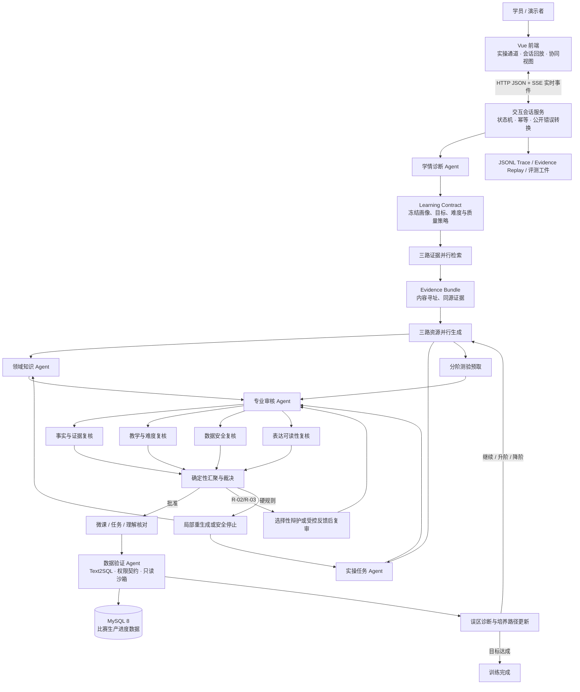

# 当前项目完整说明

> - 文档日期：2026-07-29
> - 当前创新代码冻结点：`6e2042e`（`innovation-ab-code-freeze-20260729`）
> - 最终评测与部署证据：`9ad5623`（`innovation-ab-final-20260729`）
> - 未到终点与消融复核补充：`cbe468d`

## 1. 项目一句话定义

本项目是一套面向船舶制造数字化岗位培训的、证据约束的多智能体个性化学习与协同决策系统：它根据学员画像和岗前测评生成差异化微课、实操任务与分阶测验，允许学员对真实生产进度数据进行受控查询，再通过多角色并行审核、反证追问和自适应路径更新完成“诊断—学习—实操—核验—纠偏—再学习”的闭环。

它不是一个只展示 Agent 动画的大模型 Demo，也不是让多个模型自由聊天。其核心是：

- 用岗位画像和诊断结果决定“教谁、教什么、教到什么难度”；
- 用领域知识、业务数据和教学策略三类证据约束生成；
- 用有序主链与局部并行 DAG 协调多个 Agent；
- 用专业审核、SQL 沙箱和确定性裁决阻止未批准内容进入学员侧；
- 用理解核对与误区关系，在安全边界内更新后续培养路径；
- 用完整消息、状态、审核、耗时和评测记录支持复现与答辩。

## 2. 项目要解决的问题

船舶制造岗位培训同时面对三类矛盾：

1. 不同岗位的知识基础差异大。会 SQL 的新员工可能不懂工序口径，熟悉工艺的工程师可能不会使用数据工具，一线班组长则更需要短句、步骤和现场检查点。
2. 通用大模型容易把领域口径、事实证据和教学表达混在一起，生成内容看似完整，但可能出现引用不支持、计划量与实际量混淆、难度错配或 SQL 越权。
3. 单 Agent 串行链路既慢又缺少相互制约；完全自由的多 Agent 群聊又难以审计、难以复算，也容易发生上下文漂移。

本项目采用“受编排的多智能体系统”解决这些问题。模型负责受约束的理解和生成，代码负责范围、状态、权限、证据绑定、并发、裁决、提交时机和失败收尾。

## 3. 与赛题要求的对应关系

| 赛题关注点 | 当前项目的实现 |
|---|---|
| 领域知识个性化生成 | 三种岗位画像、5 道岗前测评、知识盲区诊断、难度分级、个性化讲义与任务 |
| 多智能体协同决策 | 五类对外 Agent、三个并行 Fork/Join 阶段、审核专项分支、确定性汇聚 |
| 数据驱动学习 | 基于比赛数据的 Text2SQL、只读执行、数据结果复核、反证式追问 |
| 动态培养路径 | 正确、首次错误、反证后改正、持续薄弱等结果进入 21 条状态转移 |
| 可靠性与可解释性 | Learning Contract、Evidence Bundle、审核规则、SQL 沙箱、审计消息、回放 |
| 可量化评测 | 幻觉率、知识覆盖率、自动适配率、到达终点率、并行耗时和消融实验 |
| 跨域能力 | `production_progress` 主域与 `first_segment` 第二域采用同一配置协议并做独立回归 |

## 4. 适用对象与三种学员画像

| 画像 | 既有优势 | 先验短板 | 起始难度 | 生成策略 |
|---|---|---|---|---|
| 新入职生产计划员 `planner_new` | SQL 基础、数据分析工具 | 工序关系、业务口径、传导时滞 | `basic` | 重讲工序与口径，减少基础 SQL 讲解 |
| 转岗数字化工艺工程师 `craft_engineer` | 船舶工艺知识、现场生产经验 | 完成率、月度聚合、跨工序归因和数据工具 | `applied` | 重讲数据工具与图表解读，减少工艺常识 |
| 一线班组长（晋升培训）`line_leader` | 现场操作经验 | 理论与数据基础、风险识别和责任定位 | `basic` | 短句、步骤化表达、每步带检查点，基础案例优先 |

画像只是起点。系统不会仅按岗位固定推送课程，而是把 5 道岗前测评的实际结果与画像先验合并，形成当次会话的学习契约。

## 5. 总体架构

系统由五层组成：

1. **交互层**：Vue 3 前端，负责学员操作、会话回放和协同可视化。
2. **编排层**：Python 交互服务、状态机、审核闭环和 SSE 事件流。
3. **Agent 层**：诊断、知识、任务、验证、审核五类职责。
4. **约束与证据层**：学习契约、证据包、消息协议、关系图、查询权限和规则表。
5. **数据与评测层**：MySQL 只读数据、冻结回放、固定桩、回归集、指标与消融脚本。

## 6. 五类 Agent 的职责

| Agent | 主要输入 | 主要输出 | 不允许自行决定的事项 |
|---|---|---|---|
| 学情诊断 Agent | 岗位画像、5 道前测答案 | 知识盲区、命中误区、起始难度、诊断说明 | 不能改变领域包和质量规则 |
| 领域知识 Agent | 学习契约、知识切片、证据包 | 个性化微课、带证据声明的知识内容 | 不能编造事实、数据或未声明因果 |
| 实操任务 Agent | 知识目标、难度、任务模板、业务证据 | 岗位化任务、实操指南、分阶测验 | 不能更改标准 SQL 的查询权限和指标口径 |
| 数据验证 Agent | 学员问题或 SQL、意图族、模板权限 | 安全 SQL、只读查询结果、可审核的数据结论 | 不能执行写操作、越表越列或扩大任务范围 |
| 专业审核 Agent | 待发布产物、证据、画像、诊断与契约 | `approve`、`approve_with_fix`、`reject` 及受约束修正方向 | 不能跳过硬规则、不能直接把未审内容发给学员 |

`FollowUpAgent` 是理解核对与追问能力组件，服务于实操任务和路径更新，不作为第六个对外参赛角色。分阶测验生成也是实操任务能力的内部并行分支。

### 6.1 专业审核 Agent 内部结构

专业审核不是一个单模型打分器。它包含四个专项分支，并由确定性仲裁器汇聚：

| 专项分支 | 主要检查 |
|---|---|
| 事实与证据复核 `evidence_review` | R-02：引用是否真正支持结论 |
| 教学与难度复核 `pedagogy_review` | R-03：是否符合画像、盲区、难度和已学内容 |
| 数据安全复核 `data_safety_review` | R-01/R-05 相关的数据口径、SQL 安全与结果边界 |
| 表达可读性复核 `readability_review` | R-06：是否泄漏内部字段、是否存在不可读长段落 |

在专项并行前，代码还会执行 R-01、R-04、R-05、R-06 的确定性预检。生产环境的审核 Fork/Join 包含四个分支，但并发上限为 3；因此“四维并行审核”表示四个独立审核任务属于同一并行阶段，不表示四个线程在所有时刻都同时占用。

## 7. 完整学习工作流

1. 学员选择岗位画像，系统创建会话。
2. 学员完成固定 5 题岗前测评。
3. 诊断 Agent 生成知识盲区、误区和难度，并通过消息与结构校验。
4. 编排器生成不可变的 Learning Contract。
5. 系统并行取得领域知识、业务任务证据和教学策略，汇聚为 Evidence Bundle。
6. 系统并行启动微课生成、实操任务预取和分阶测验预取。
7. 产物进入专业审核；批准后才能出现在学员侧。
8. 学员学习微课并领取任务，在数据实操区提交只读查询。
9. 数据验证 Agent 执行意图识别、Text2SQL、模板权限检查和 SQL 沙箱校验。
10. 查询结果经审核后，系统要求学员用自己的话作出判断，而不是只看模型结论。
11. 理解核对持续 2～4 轮：正确则更新路径；首次错误则生成反证任务；持续薄弱则降阶回补；已掌握则升阶或进入下一知识点。
12. 达成培养目标后进入 `S10_DONE`。任何必需分支、审核或安全条件失败时，系统局部重试或 fail-closed，不静默放行。

### 7.1 状态机与 21 条转移

| 转移 | 从 | 触发条件 | 到 |
|---|---|---|---|
| T01 | S0 初始化 | 画像载入成功 | S1 学情诊断 |
| T02 | S1 学情诊断 | 学情报告校验通过 | S2 知识生成 |
| T03 | S2 知识生成 | 讲义产出 | S5 专业审核 |
| T04 | S5 专业审核 | 讲义批准 | S3 任务生成 |
| T05 | S5 专业审核 | 驳回且未达重试上限 | S6 受控反馈/辩护 |
| T06 | S6 受控反馈/辩护 | 复审批准 | 原定下游 |
| T07 | S6 受控反馈/辩护 | 复审仍驳回且未达上限 | 原生产 Agent |
| T08 | S5/S6 | 达到重试上限 | 安全兜底 |
| T09 | S3 任务生成 | 任务产出 | S5 专业审核 |
| T10 | S5 专业审核 | 任务批准 | S7 学员操作 |
| T11 | S7 学员操作 | 学员提交 SQL | S4 数据验证 |
| T12 | S4 数据验证 | 查询执行完毕 | S5 专业审核 |
| T13 | S5 专业审核 | 数据结论批准 | S9 路径更新 |
| T14 | S7 学员操作 | 学员回答正确 | S9 路径更新 |
| T15 | S7 学员操作 | 首次回答错误 | S8 反证追问 |
| T16 | S8 反证追问 | 反证后改正 | S9 路径更新 |
| T17 | S8 反证追问 | 二次仍错 | S2 降阶补学 |
| T18 | S8 反证追问 | 错因不在当前词表 | S7 通用教学追问 |
| T19 | S9 路径更新 | 仍有下一环节 | S3 任务生成 |
| T20 | S9 路径更新 | 学习目标达成 | S10 完成 |
| T21 | S4 数据验证 | 未形成可审核结论 | S7 调整后重试 |

另有 `S_FAIL` 表示安全失败终态。T06、T07、T08 的具体目标由被审产物类型确定，不使用“猜一个默认节点”的方式跳转。

## 8. 非串行的协同工作模式

当前系统已经实现真实的局部并行，不再是原版完全串行链路。并行由 `ThreadPoolExecutor` 执行，所有结果按分支声明顺序汇聚，以保证相同输入下的聚合可复现。

| 并行阶段 | 分支 | 并发上限 | 失败策略 |
|---|---|---:|---|
| 证据检索 `evidence-bundle` | 领域知识、业务数据、教学策略 | 3 | 三个均为必需；任一失败则不形成证据包 |
| 资源生成 `resource-generation` | 个性化微课、实操任务预取、分阶测验预取 | 3 | 微课为必需；两个预取分支失败时回到主链路重试 |
| 质量审核 `quality-review-axes` | 事实、教学、数据安全、可读性四轴 | 3 | 必需结果汇聚后由确定性仲裁器裁决 |

每个并行阶段都记录：

- 实际阶段墙钟时间 `parallel_elapsed_ms`；
- 各分支墙钟时间及成功状态；
- 同轮分支耗时之和 `serial_estimate_ms`；
- 估算节省时间 `saved_ms`；
- 同轮估算加速比 `speedup`；
- 最大并发数与分支成功率。

这里的 `serial_estimate_ms` 是同一次并行运行中各分支耗时的求和，不是另外执行的一轮独立串行基准。因此它能够证明“真实发生了重叠执行”，但不能替代严格控制环境下的端到端串并行性能实验。

### 8.1 为什么不是自由群聊

自由群聊很难回答“谁有权修改结果、依据是什么、失败时回到哪里”。当前系统使用：

- 固定职责：每个 Agent 只处理自己的输入和输出；
- 有序主链：业务顺序仍由状态机控制；
- 局部并行：只并行处理相互独立且有共同输入的分支；
- 确定性 Join：分支结果按声明顺序汇聚；
- 争议定向处理：只把允许讨论的审核问题送入受控闭环；
- 失败关闭：必需分支失败时不发布不完整结果。

## 9. Learning Contract 与 Evidence Bundle

Learning Contract 是由画像和诊断生成的内容寻址快照，冻结：

- 学员画像、背景、优势、先验短板和表达风格；
- 当前领域 ID 与领域包 SHA-256；
- 目标知识点、命中误区和起始难度；
- 允许使用的证据类型；
- 必须生成的资源类型；
- 硬否决规则、可讨论规则、最大审核轮次和 fail-closed 策略。

Evidence Bundle 把领域知识切片、业务任务证据和教学策略绑定到同一个 Contract ID，并生成自己的内容标识。这样，三个并行生成分支不会各自携带不同画像、不同难度或不同数据版本。

二者解决的是多 Agent 最常见的上下文漂移问题：并行可以提高效率，但每个分支仍必须在同一学习目标和同一证据边界内工作。

## 10. 审核规则与安全发布闭环

| 规则 | 含义 | 处理方式 |
|---|---|---|
| R-01 | 指标或数据口径混淆 | 硬否决，局部重生成/安全停止 |
| R-02 | 引用不支持结论 | 可进入受控反馈与复审 |
| R-03 | 难度、画像或教学策略错配 | 可修正或进入受控反馈与复审 |
| R-04 | 事实性结论缺少证据绑定 | 硬否决，局部重生成/安全停止 |
| R-05 | SQL 不安全、不可执行或空结果却作结论 | 硬否决，局部重生成/安全停止 |
| R-06 | 泄漏内部字段或表达不可读 | 硬否决，局部重生成/安全停止 |

底层闭环为：

`生成 → Review → 选择性辩护或受控反馈 → 完整复审 → 批准发布 / 局部重生成 / 安全收尾`

只有 R-02、R-03 可以讨论。R-01、R-04、R-05、R-06 以及未知规则均不接受模型“辩赢”确定性约束。

## 11. 两个已实现的创新点

### 11.1 创新 A：事务级选择性辩护

创新 A 解决“同一审核事务反复调用大模型辩护、成本不可控，并把审核内部语言污染到下一版题目”的问题。

生产默认策略是：

1. 每个自由追问审核事务的模型辩护预算为 1。
2. 第一次 R-02/R-03 软驳回可生成一次证据受限辩护。
3. 后续同类软驳回改用确定性让步，不再继续调用辩护模型。
4. 每次仍执行完整复审，不因让步跳过 Review。
5. 下一生产 Agent 只接收白名单化的教学修正要求；审核原文、规则号、消息协议和 Trace 字段不会进入学员内容。
6. 硬规则、未知规则和软硬混合驳回仍按 fail-closed 处理。

固定桩消融中，通用预算策略发生 2 次模型辩护；生产预算策略降为 1 次模型辩护并增加 1 次确定性让步，Review/复审次数和最终批准结果保持一致。该实验直接证明调用上界与反馈隔离，不证明真实学员成绩提升。

### 11.2 创新 B：审核约束的边际误区支持覆盖路由

创新 B 解决“重复答错时，仅按关系总强度选下一个误区，会反复命中已经使用过的关系依据”的问题。

生产策略是：

1. 候选目标必须属于同一领域、岗位责任范围和冻结关系图。
2. 只承认此前真正通过 Review 的关系追问所贡献的覆盖点。
3. 优先选择能增加新关系支持点的候选，而不是只看累计关系强度。
4. 所有候选边际增益为 0 时，继续深化当前误区，不为“换节点”强行跳转。
5. 问题生成后再次做确定性关系校验、Review 和后端重算。
6. 只有批准结果成功写入待返回状态后，才原子且幂等地提交覆盖历史。
7. 拒绝、系统错误、回放和失败重试均不能污染覆盖状态。

固定桩消融使用完全相同的历史前缀、轮次、诊断和回答诊断结果：B0 总支持策略跳到一个零增益节点；B1 边际策略继续深化当前误区，零增益跳转由 1 降为 0，重复贡献由 1 降为 0。该实验直接证明路由选择和提交约束，不等同于证明教学有效性。

## 12. 领域、知识、任务与数据

### 12.1 主域 `production_progress`

主域数据库为 `ref_contest_db`，核心事实表为 `fact_production_progress`，围绕船号、工序、月份、计划量、实际量、完成率、偏差率、风险等级和责任车间开展训练。

三道核心工序为：

- YCL：预处理；
- ZZTP：制作托盘；
- AZTP：安装托盘。

十个知识点为：

1. 三道工序与传导关系；
2. 计划量与实际量口径；
3. 完成率计算；
4. 偏差率与风险等级；
5. 月度聚合方法；
6. 异常识别标准；
7. 传导时滞分析；
8. 异常衰减规律；
9. 责任单元定位；
10. 跨工序归因方法。

任务配置包含 30 个模板，覆盖 `basic`、`applied`、`advanced` 三档。Text2SQL 分为 Q1～Q7 和 `OUT_OF_SCOPE`：单量、计划与实际、单比率、单工序时序、跨船比较、跨工序比较、责任单元下钻及范围外请求。

### 12.2 第二域 `first_segment`

第二域采用同一配置协议，数据源标识为 `first_segment_csv`，包含独立 schema、意图、任务、反证关系和安全范围。其作用是验证：

- Agent 和状态机是否由领域包驱动，而不是把主域字段硬编码到公共层；
- 域交换后是否保持安全查询和完整交互；
- 关系不足时是否安全退化；
- 主域误区、关系和私有状态是否不会串入第二域。

第二域证据独立于正式 50×2。当前结果证明配置驱动、完整固定桩交互和零串域，不证明第二域已经获得与主域相同的多节点选靶收益。

### 12.3 随包数据

`data/比赛数据包/` 包含：

- `dim_date.csv`
- `dim_process.csv`
- `dim_ship.csv`
- `dim_workshop.csv`
- `fact_production_progress.csv`
- `data_dictionary.md`
- `import_mysql.sql`

MySQL 8 由只读账号访问。数据包、领域包和代码中不应保存正式模型密钥。

## 13. 数据查询与 SQL 安全

数据验证并非直接执行模型输出。完整路径是：

1. 确定问题属于哪个意图族；
2. 生成 JSON 格式的候选 SQL；
3. 检查任务模板授权的输出列、过滤列、分组列和时间列；
4. 使用 `sqlglot` 解析 AST；
5. 只允许单条 SELECT；
6. 只允许白名单数据库、表和字段，禁止 `SELECT *`；
7. 禁止注释、锁、文件读取、系统函数、变量、非确定性函数和写操作；
8. 自动将结果限制在最多 200 行；
9. 使用 MySQL 只读连接执行；
10. 执行结果还要进入专业审核，之后才能形成学员侧数据结论。

若 SQL 生成、权限契约或沙箱校验失败，系统走 T21 返回学员调整，不会执行被拒绝的 SQL，也不会伪造查询结果。

## 14. 模型调用边界

项目通过 DashScope 的 OpenAI 兼容接口调用模型：

| 能力 | 当前模型 |
|---|---|
| 诊断说明、审核、意图路由 | `qwen3-32b` |
| 知识生成、任务生成、追问、Text2SQL、选择性辩护 | `qwen3-235b-a22b` |

统一模型边界具有以下约束：

- 只接受 JSON 对象输出；
- 本地执行 JSON Schema 校验；
- `temperature=0.1`；
- 单次请求超时 60 秒；
- 解析、Schema 或服务失败共用最多 3 次尝试；
- 关闭思考内容输出，不把内部推理显示给学员；
- 密钥只从 `DASHSCOPE_API_KEY` 环境变量读取。

模型不能直接改变状态机、审核规则、SQL 白名单、学习契约、关系图或覆盖提交结果。

## 15. 前端能力与表现

前端采用 Vue 3、TypeScript、Vite、ECharts 和 Lucide Vue，包含两种入口模式和两种观察视角。

### 15.1 入口模式

- **实时实操**：连接后端完成真实岗前测评、微课、任务、SQL 和理解核对。
- **会话回放**：播放冻结 JSONL Trace，支持播放/暂停、步进、速度、关键帧、三画像切换以及 JSONL 导入导出。

### 15.2 观察视角

- **学员模式**：只展示岗位画像、培养路径、微课、实操、查询结果、理解核对和学习成就。
- **协同视图**：展示五类 Agent、实时状态、并行分支、专业审核小组、确定性汇聚和近期协作事件。

### 15.3 Agent 动效

协同舱中的卡通角色具有待机、工作、协同、审核、辩护、完成和阻断等视觉状态。动效包括：

- 工作扫描、状态脉冲和任务柱；
- Agent 之间的数据包与胶囊沿路径移动；
- 并行时多个角色同时进入工作或协同状态；
- 专业审核小组显示专项分支的运行和汇聚；
- 背景虚线轨道持续旋转；
- 待机和完成角色保留轻微环境粒子，避免画面完全冻结；
- 动效进度由 JavaScript 时钟推进，减少外部浏览器只显示静态关键帧的问题；
- 提供暂停/继续动效按钮，并尊重系统的 `prefers-reduced-motion` 设置。

动效由后端 SSE 的真实 Agent 生命周期事件驱动，不作为并行真实性的唯一证据；同一协同视图还展示阶段耗时、分支状态和 Join 结果。

### 15.4 学员侧信息隔离

前端会翻译或屏蔽内部工程字段。规则号、状态枚举、消息 ID、Trace ID、查询权限对象、答案键、标准 SQL、覆盖集合和异常堆栈不会直接泄漏到学员内容。

## 16. 后端接口

后端是基于 Python `ThreadingHTTPServer` 与 `BaseHTTPRequestHandler` 的轻量服务，不是 FastAPI。

| 方法 | 接口 | 用途 |
|---|---|---|
| POST | `/api/sessions` | 按画像创建会话 |
| GET | `/api/sessions/{id}` | 获取当前权威状态 |
| GET | `/api/sessions/{id}/pretest` | 获取 5 道前测 |
| POST | `/api/sessions/{id}/pretest` | 提交前测并生成诊断 |
| POST | `/api/sessions/{id}/advance` | 推进当前自动步骤 |
| POST | `/api/sessions/{id}/continue` | 进入下一培养内容 |
| POST | `/api/sessions/{id}/sql` | 提交学员 SQL |
| POST | `/api/sessions/{id}/follow-up` | 提交理解判断，带 `client_turn_id` 保证幂等 |
| GET | `/api/sessions/{id}/events` | SSE Agent 活动流，支持 `Last-Event-ID` 或 `after` 续接 |

请求体上限为 1,000,000 字节。SSE 事件名为 `agent-activity`，无新事件时每 15 秒发送一次 keep-alive。公开接口将内部异常转换为中文安全文案。

## 17. 鲁棒性、审计与可复现性

当前系统具有以下防线：

- 消息必须通过统一 JSON Schema；
- 学习契约与证据包均内容寻址；
- 并行分支结果顺序确定；
- 审核只接受带证据引用的规则命中；
- 硬规则不允许模型辩护覆盖；
- SQL 先校验后执行，数据库连接只读；
- 重复前端请求通过状态检查和 `client_turn_id` 实现幂等；
- 失败不会返回内部异常文本或凭据；
- 关系覆盖只在审核批准后提交，失败零污染；
- JSONL Trace、Review 事件、并行耗时、Token 和评测账本支持回放与复算。

需要注意：实时会话对象当前保存在后端进程内存中；运行记录可写入运行目录，但服务重启后不会像生产级学习平台那样自动恢复正在进行的会话。

## 18. 测试与最终评测结果

代码冻结点 `6e2042e` 的最终门禁结果为：

- 后端非 live：`1100 passed, 22 deselected`；
- A+B/Review/自由追问组合压力集：`51 passed`；
- A/B 定向复核：`36 passed`；
- 前端：`28 files, 278 tests passed`；
- 前端生产构建：成功；
- 21 条状态转移、R-01～R-06、SQL 安全边界与三指标算法未放宽。

### 18.1 正式 50×2

“50×2”指同一冻结组合版本对固定 50 例矩阵独立执行两轮，每个案例每轮只执行一次；它不是“两个领域各 50 例”。

| 指标 | Round 1 | Round 2 |
|---|---:|---:|
| 幻觉率 | 2/987 = 0.2026% | 2/973 = 0.2055% |
| 知识覆盖率 | 10/10 = 100% | 10/10 = 100% |
| 自动适配率 | 163/163 = 100% | 159/159 = 100% |
| 到达学习终点 | 49/50 = 98% | 47/50 = 94% |
| safe_rejected | 0 | 2 |
| system_error | 1 | 1 |

两轮三项比赛指标均达到最高档阈值。四条幻觉事件是同一案例在两轮中分别出现的原审核和复审 R-02 不支持草稿，均被 Review 捕获并阻断；指标算法仍如实计入，因此不能声称“幻觉绝对为 0”。

四个未到终点案例分别由讲义 R-04 预检耗尽和 SQL 查询权限越界触发安全停止。经基线、控制流和直接触发点复核，这些停止不是创新 A/B 新增逻辑造成的；A/B 路径在相应失败前尚未执行，或根本不处于正式 runner 覆盖的自由追问路径。

### 18.2 消融实验的证据口径

- A 消融证明模型辩护调用从 2 次收敛到 1 次、后续使用确定性让步，并保持完整复审和终态批准。
- B 消融证明零边际收益跳转与重复关系贡献由 1 降到 0。
- A+B 组合门禁证明共享状态、Review 和失败语义没有互相破坏。
- 正式 50×2 证明最终组合版本的三项比赛指标仍过门槛。
- 第二域固定桩与 domain-swap 回归证明配置迁移和零串域。

这些证据不能替代真实学员对照实验。专业人员抽检只用于确认题目、答案和证据的专业正确性，不作为 B 的生产启用硬门禁，也不用于宣称教学有效性。

## 19. 部署与三个可并存版本

| 版本 | 地址 | 用途 |
|---|---|---|
| 旧版 1.1.0 | `http://127.0.0.1:18080/` | 保留同学原有环境与历史对照 |
| 原协同重构版 | `http://127.0.0.1:18081/` | 展示并行协同重构、尚未加入创新 A+B 的对照 |
| 当前创新 A+B 版 | `http://127.0.0.1:18082/` | 当前推荐演示和继续开发的版本 |

创新版本使用 `Docker镜像/docker-compose.innovation-ab.yml`：

- 前端宿主端口默认 `18082`；
- 后端宿主端口默认 `18767`，容器内端口 `8765`；
- 前后端容器独立于旧版；
- 只通过外部 Docker 网络共享旧版的只读比赛数据库；
- 后端运行目录使用独立 volume；
- 不应执行 `docker compose down -v`，以免误删数据库或运行卷。

规范 Dockerfile 的 clean build 曾因 Docker Hub 匿名 Token 接口 `EOF` 未完成。本机运行终验使用已验证运行时镜像作为依赖层，覆盖冻结源码和通过测试的前端产物，容器测试与 HTTP 烟测通过。网络恢复后，学生仍应按 `Docker镜像/README.md` 从规范 Dockerfile 构建。

`source_package/VERSION.txt` 中的 `1.1.0` 和前端 `package.json` 中的 `1.0.0` 是原交付包的历史版本标识；判断当前创新版本应以 Git 标签/提交和 18082 Compose 为准。

## 20. 学生或评委如何手动验证

### 20.1 验证个性化

1. 分别选择三个岗位画像。
2. 对相同知识点完成不同前测结果。
3. 对比诊断盲区、讲义风格、任务难度和后续路径。
4. 不应只看到岗位名称变化，讲义重点、措辞和任务上下文也应变化。

### 20.2 验证真实并行协同

1. 打开 `http://127.0.0.1:18082/` 并切换到协同视图。
2. 完成前测后打开微课。
3. 观察领域知识、实操任务和测验分支同时收到派发事件。
4. 观察专业审核小组的事实、教学、数据安全和表达分支。
5. 检查协同证据区中的同一阶段分支耗时、墙钟时间、估算串行时间和 Join 状态。
6. 不能只凭人物同时亮起判断并行，耗时记录和 `stage_started/branch_started/stage_completed` 事件才是底层证据。

### 20.3 验证 SQL 安全

1. 完成数据实操题并提交符合题意的 SELECT，确认得到真实结果。
2. 尝试提交写操作、多语句、`SELECT *`、越权字段或扩大任务输出列。
3. 系统应阻断查询并允许调整，不应执行或生成伪造数据。

### 20.4 验证自适应和创新 B

1. 在理解核对中故意提交与当前误区一致的错误判断。
2. 完成反证追问后再次暴露同一误区。
3. 系统应只在已有审核批准关系能提供新支持点时关联探查；无新支持点时深化当前误区。
4. 前端只显示教学语言，不应出现 `covered_relation_points`、`marginal_support` 或内部规则号。

### 20.5 验证回放与可审计性

1. 进入会话回放，播放三种画像的冻结 Trace。
2. 使用暂停、单步、倍速和关键帧观察状态变化。
3. 导出 JSONL 后重新导入，确认能够重建同一会话。
4. 对照 Trace 中的状态、审核、证据引用和 Agent 事件，确认画面不是独立编排的假动画。

## 21. 当前项目的真实边界

当前已经具备：

- 完整可运行的岗位培训闭环；
- 五类职责清晰的 Agent；
- 三处真实有界并行与确定性汇聚；
- 受证据约束的生成、审核、复审和安全收尾；
- Text2SQL、只读沙箱和任务权限；
- 创新 A 的选择性辩护和创新 B 的边际误区路由；
- 实时实操、回放、协同动效和评测证据；
- 主域正式 50×2、第二域独立回归和固定桩消融。

当前尚不应宣称：

- 幻觉率绝对为 0；
- 所有正式案例都到达终点；
- 50×2 证明两个领域整体能力；
- A/B 已被真实学员实验验证能提升学习成绩；
- 当前是支持账号、权限、持久化恢复和多租户的生产级平台；
- 同轮串行估算等同于独立串行基线实验；
- 第二域已经证明多节点误区路由收益。

下一阶段如果继续产品化，优先工作应是：会话持久化与恢复、身份和权限、正式可复现 clean build、运行监控、更多领域包、真实学员小规模对照实验，以及在不放宽安全门禁的前提下减少 R-04 和查询权限类非终点案例。

## 22. 代码导航

| 路径 | 内容 |
|---|---|
| `source_package/agents/` | 五类 Agent、审核分支、Text2SQL、SQL 沙箱和画像 |
| `source_package/orchestrator/` | 21 条状态转移、会话服务、审核闭环、事件流和运行时 |
| `source_package/coordination/` | Learning Contract、Evidence Bundle、有界并行、争议与工件协议 |
| `source_package/config/domains/` | 主域与第二域配置包 |
| `source_package/frontend/` | Vue 实操、回放、协同舱和动效 |
| `source_package/data/比赛数据包/` | CSV、数据字典和 MySQL 导入脚本 |
| `source_package/eval/` | 单元测试、回归、正式 runner、三指标和 A/B 消融 |
| `source_package/traces/` | 脱敏冻结会话回放 |
| `source_package/evidence/replays/` | 审核驳回与复审回放证据 |
| `Docker镜像/` | 三版并存的 Docker 构建与 Compose 配置 |
| `文档与配置/01_可交付_学生可提交/` | 学生、演示和评委可阅读材料 |
| `文档与配置/02_不可交付_内部材料/` | 内部复核、消融、因果审计和答辩材料 |

## 23. 最终定位

当前项目最准确的定位是：

> 一套面向船舶制造数字化岗位培训的、以学习契约和证据包为共享上下文、以有序状态机和局部并行 DAG 为协同骨架、以多轴审核和确定性安全边界为质量门、以反证追问和边际误区覆盖为自适应机制的可运行多智能体系统。

它的创新不在于“Agent 数量多”或“界面会动”，而在于把个性化、并行协同、证据约束、争议处理、数据安全、自适应路由和可复算评测放进了同一条可执行、可观察、可失败关闭的业务链路中。
