# 三岗位与主要功能图文操作手册

版本日期：2026-08-20

适用版本：比赛冻结版（Git 提交 `7ab77d5dcdf0e5d4e695e5f4866df660f0be2082`）
适用对象：首次接触本系统的学生、课堂演示人员与功能验收人员

## 1. 先理解这套系统在做什么

系统不是普通的“问一句、答一句”聊天页面，而是一条可追溯的岗位训练闭环：

> 选择岗位画像 → 岗前测评与必要的校准探针 → 生成个性化学习计划 → 阅读岗位微课 → 在只读数据库中实操 → 用查询证据回答导师追问 → 动态升档、补学或进入下一知识点 → 生成训练报告。

学生主要操作“学员”通道；“系统管理员”通道用于查看多 Agent 协同、运行拓扑、证据与回放，须使用教师提供的管理员账号。

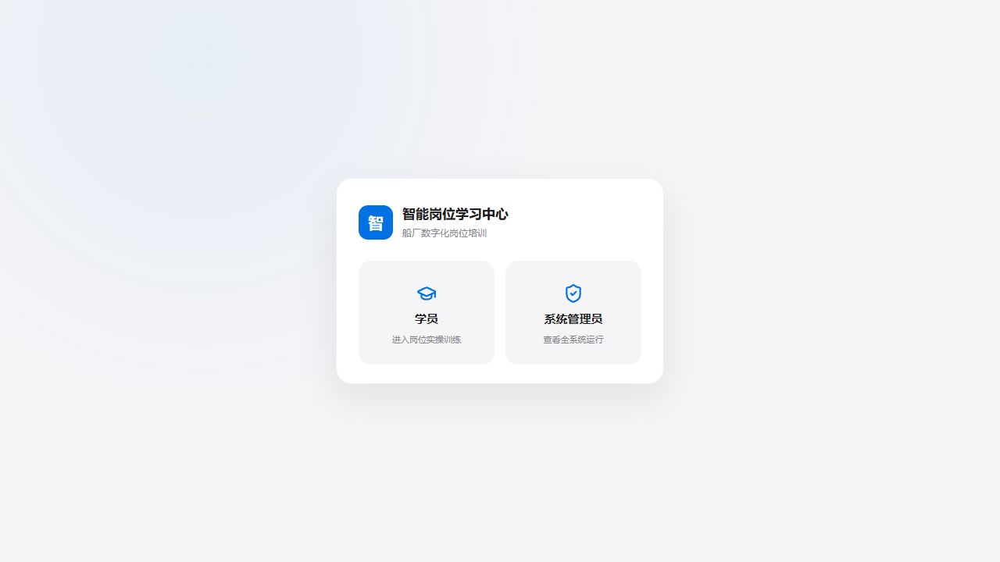

## 2. 登录、游客与学习记录

1. 打开本地地址 `http://127.0.0.1:18185/`，或教师提供的服务器地址。
2. 点击“学员”。
3. 已有账号时登录；首次长期使用可注册；只想快速体验时点击“跳过”。
4. 游客可以完成训练，但学习记录不与个人账号长期绑定。需要连续学习记录时应使用学员账号。

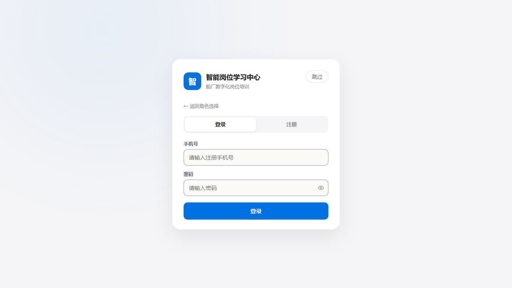

进入后先看到四步训练说明。点击“开始选择岗位”。

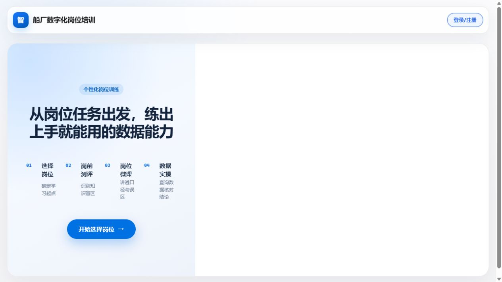

## 3. 三个岗位画像怎么选

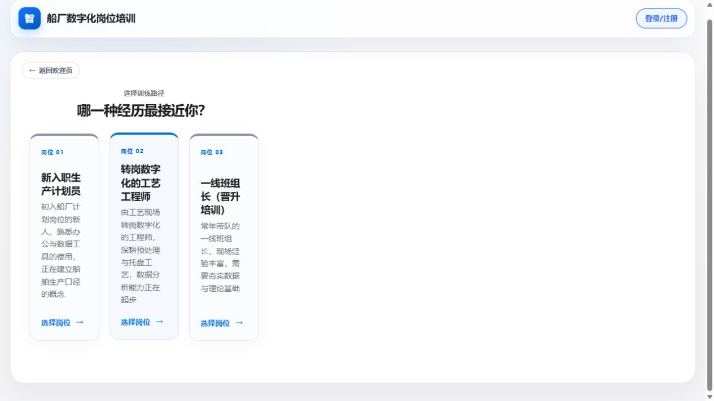

| 岗位画像 | 更适合谁 | 建议重点观察的系统能力 |
|---|---|---|
| 新入职生产计划员 | 初入计划岗位、会基础办公与数据工具，但船舶生产口径较弱 | 自动诊断、基础 SQL、安全沙箱、计划量与实际量口径、证据绑定追问 |
| 转岗数字化的工艺工程师 | 熟悉工艺现场，正在补数据分析与跨工序分析能力 | 人工关注点、诊断探针、前置知识补齐、跨工序归因、错误纠正门禁 |
| 一线班组长（晋升培训） | 现场经验强、理论与数据基础需要补齐 | 低分诊断、基础档起步、分级提示、T17 补学、deferred 优雅退出 |

### 3.1 画像一：新入职生产计划员

可保持“由岗前测评自动诊断”，让系统根据真实答题决定知识点和起始难度；也可选择具体关注点进行定向训练。

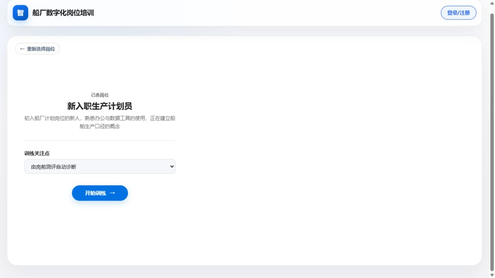

建议课堂演示：

- 自动诊断后观察系统为什么从基础档或应用档开始；
- 在 SQL 区先输入一次非 `SELECT` 写操作，观察安全沙箱拦截；
- 再提交合法查询，用结果字段和值回答导师追问；
- 完成后查看难度轨迹与训练报告。

### 3.2 画像二：转岗数字化的工艺工程师

该画像可选“计划量与实际量口径、完成率计算、偏差率与风险等级、月度聚合、异常识别、责任单元定位、跨工序归因”等关注点。


建议课堂演示：

- 选择“跨工序归因方法”，观察系统是否先补必要的前置知识；
- 在第一次导师追问中故意给出错误结论；
- 根据老师评价纠正后再提交，确认历史错误未纠正前不会直接升档。

### 3.3 画像三：一线班组长（晋升培训）

该画像重点覆盖计划/实际口径、完成率、偏差风险、异常识别与责任定位，适合观察“从现场经验转成数据证据”的过程。

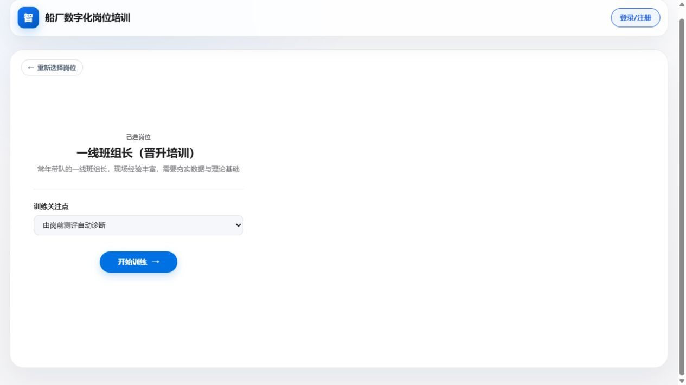

建议课堂演示：

- 选择“异常识别标准”；
- 前测与校准探针故意答错，确认系统从基础档开始；
- 连续给出不充分回答，观察第一次补学是否换解释角度；
- 再次连续未通过时，观察当前知识点是否标记为后续补学并安全进入下一知识点。

注意：`deferred` 表示“延后补学”，不是“已经掌握”。

## 4. 岗前测评与补充诊断怎么操作

1. 每题选择一个选项后点击“下一题”。
2. 顶部数字可返回检查已答题目。
3. 最后一题作答后点击“提交岗前测评”。
4. 系统会根据需要追加 0-2 道固定诊断探针；题数以页面显示为准。截图中的会话共显示 6 题。
5. 提交后进入“训练准备”时不要重复点击，等待领域知识生成与专业审核完成。

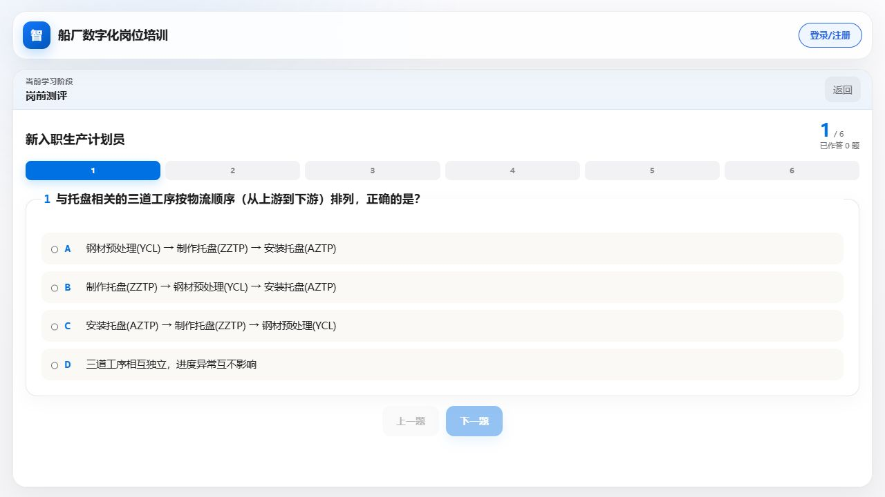

你需要观察的不是“分数越高越好”，而是：

- 学习清单是否由真实错题与探针证据产生；
- 初始难度是否与答题表现一致；
- 正确回答是否不会被误记为盲区；
- 人工关注点是否与诊断盲区去重。

## 5. 阅读个性化微课与学习画像

微课包含本节目标、核心概念、计算方法、常见误区和小结。右侧画像显示岗位、前测成绩、当前档位、学习清单和难度轨迹。

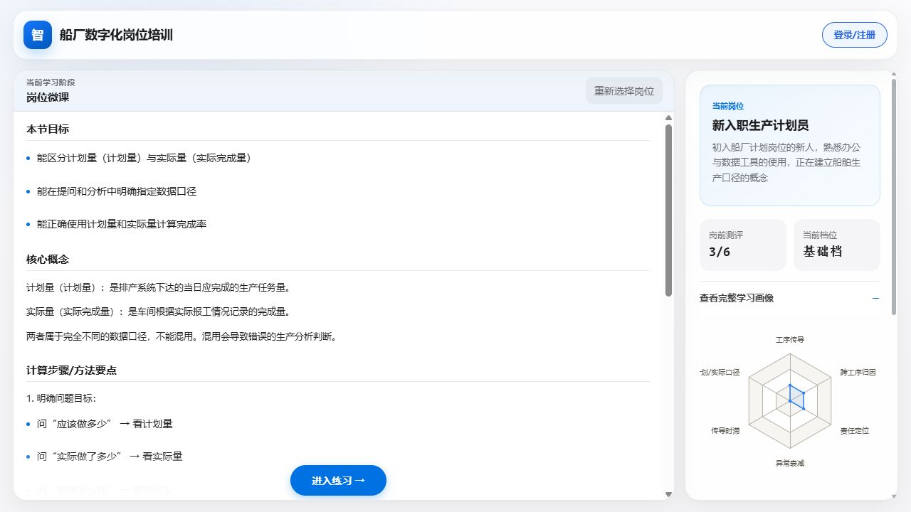

操作建议：

1. 先读“本节目标”，明确本轮要形成什么能力。
2. 重点看“常见错误提醒”，追问审核会检查这些误区是否真正纠正。
3. 展开完整学习画像，确认“进行中、待学习、已完成”状态是否合理。
4. 点击“进入练习”后再开始数据实操。

## 6. SQL 实操怎么做

实操区只允许只读查询。左侧/指南区显示题目、难度、操作步骤、完成标准与分级提示；右侧/操作区输入 SQL 并运行。

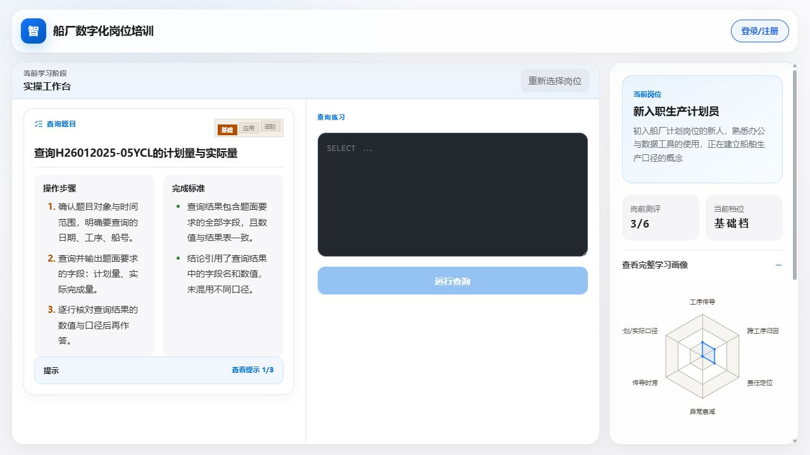

截图任务“查询 H2601 2025-05 YCL 的计划量与实际量”可使用：

```sql
SELECT
  SUM(plan_qty) AS plan_qty,
  SUM(actual_qty) AS actual_qty
FROM fact_production_progress
WHERE ship_no = 'H2601'
  AND process_code = 'YCL'
  AND period_date >= '2025-05-01'
  AND period_date < '2025-06-01';
```

重要规则：

- 只能使用 `SELECT`；`DELETE`、`UPDATE`、`INSERT` 等写操作会被拦截。
- 必须使用题目允许的表、字段、船号、工序和时间范围。
- 完成率应按“先汇总再相除”计算，不能直接平均明细完成率。
- 查询失败 1-2 次先看具体错误；继续失败时系统会逐级给出结构化提示或半填充模板。
- 不要连续快速点击“运行查询”，等待按钮恢复后再操作。

## 7. 查询结果与导师追问怎么答

查询成功后会显示结果表，并进入最多若干轮的理解校对。回答不能只有“是”“不是”“0.6236”，也不能复述题目；要把字段、值、对象和结论绑定起来。

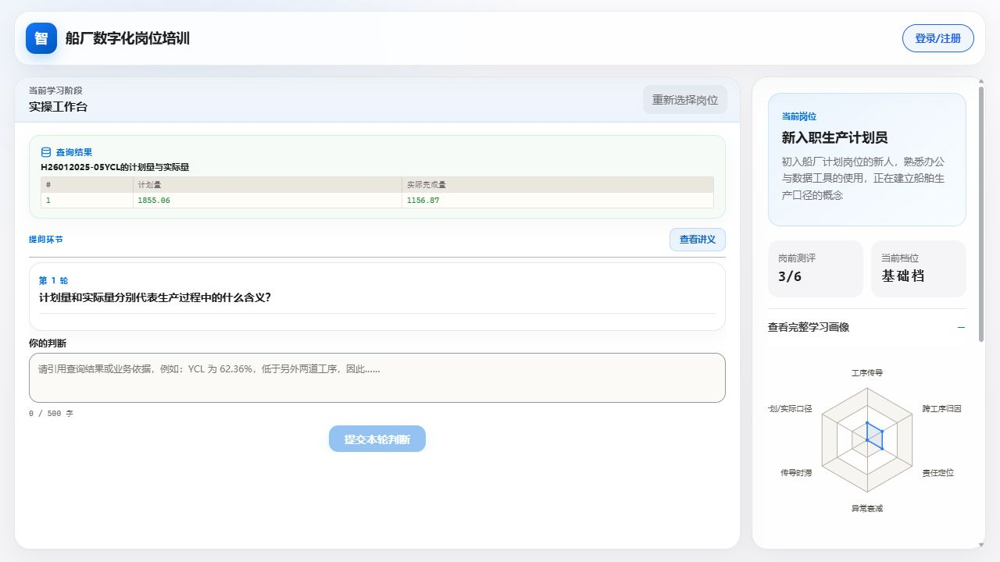

推荐回答结构：

> 对象/字段 + 查询值 + 业务含义 + 判断理由。

例如：

> 查询结果中 `plan_qty=1855.06`，表示计划应完成量；`actual_qty=1156.87`，表示实际报工完成量。两者口径不同，不能混用。

系统会综合检查：

- 是否引用了当前查询中的真实字段和值；
- 结论是否与结果表一致；
- 是否仍存在前几轮暴露的误区；
- Review 是否通过；
- 是否满足升档、保持、补学或进入下一知识点的确定性条件。

一次答对不一定立即升档。历史错误必须先被明确纠正；老师评价会说明为什么继续追问、升档或补学。

## 8. 训练报告、画像更新与下一知识点

完成当前训练闭环后，报告页会汇总：

- 岗前测评结果；
- 数据查询次数；
- 最终校对轮数；
- 是否发生结论纠正；
- 最终难度与知识点状态；
- 后续建议与下一知识点。

验证时请检查：

1. 已完成知识点在画像中不再显示“未学习”。
2. 最终难度与难度轨迹一致。
3. 延后补学知识点明确标记为 `deferred`，没有伪装成掌握。
4. 报告不应继续遮挡在旧查询结果下面。
5. “下一步”入口可见，且进入的是学习计划中的下一个知识点。

## 9. 学习助手怎么用

学员模式中的可拖动学习助手用于显示后台 Agent 当前职责、总体进度与最近完成事项：

- “正在工作”表示当前有 Agent 生成、审核或验证；
- “等待”表示当前需要学员操作；
- 完成列表用于确认资源审核、分阶测验、表达校对等节点已经结束。

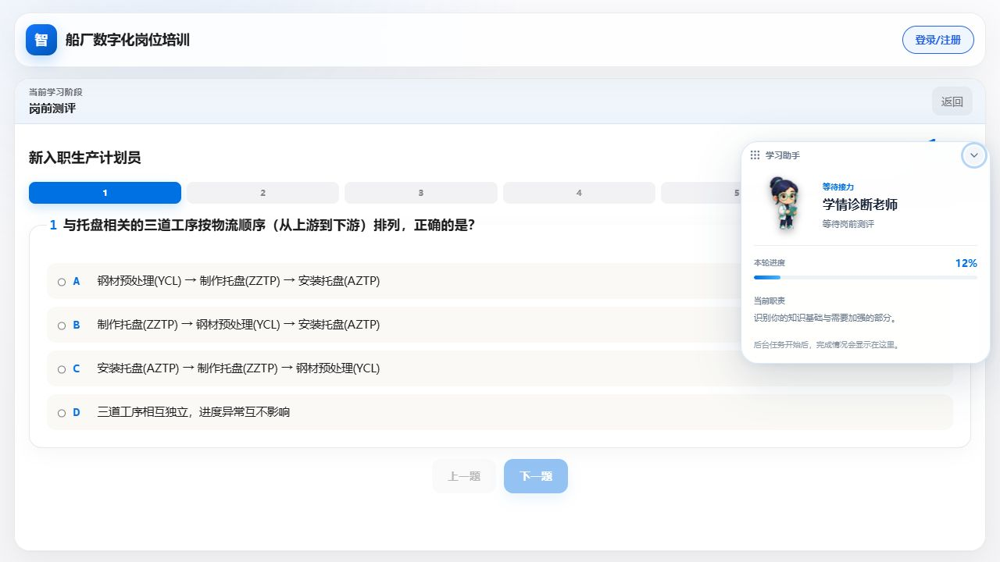

实际操作：

1. 开始任一岗位训练后，学习助手常驻在页面右侧；岗位选择页、管理员协同视图和会话回放不会显示它。
2. 点击头像或右上角箭头可展开、收起详情。
3. 按住“学习助手”标题区域拖动，可把卡片移动到不遮挡题目或查询结果的位置；浏览器会记住最后位置。
4. “本轮进度”是后台工作阶段的说明，不等同于成绩；当前 Agent、当前职责和最近完成事项会随会话事件更新。
5. 若助手显示“等待接力/等待结果”，先看主任务区是否正在等待你答题、运行查询或提交判断，不要连续重复点击。

它用于解释系统状态，不替代题目、微课或导师评价。

## 10. 管理员可查看的协同功能

管理员登录后可切换“学员模式/协同视图”，主要包括：

| 页面 | 用途 | 应看什么 |
|---|---|---|
| 实时协同 | 查看学情诊断、领域知识、实操任务、数据验证、专业审核等 Agent 状态 | 工作中/等待/完成、并行审核、确定性汇聚 |
| 运行拓扑 | 查看 Python 模块、Agent、审核子节点与状态机的连接 | 当前激活节点、输入摘要、输出摘要、节点日志 |
| 效能证据 | 查看本轮并行执行、证据绑定、审核与资源汇聚结果 | 是否真实并行、是否有证据、审核是否通过 |
| 协作记录 | 按时间查看每个 Agent 做了什么 | 操作时间、角色、动作、结果与拒绝原因 |
| 会话回放 | 复盘指定训练会话 | 选择正确会话，核对关键状态转移与前端显示 |

多人同时使用服务器时，必须先根据会话时间、岗位画像和会话标识选择自己的会话，不能只看“最新一条”。管理员账号由教师单独提供，不写入手册、截图或代码仓库。

## 11. 三组推荐探索任务

### 任务 A：安全、证据与完整闭环

1. 画像：新入职生产计划员。
2. 关注点：自动诊断。
3. SQL：先提交一次写操作，确认被安全拦截；再提交合法 `SELECT`。
4. 追问：每轮引用结果字段和值。
5. 目标：看到安全沙箱、证据绑定、难度更新和训练报告。

### 任务 B：个性化路由与错误纠正

1. 画像：转岗数字化的工艺工程师。
2. 关注点：跨工序归因方法。
3. 前测：正常作答并完成必要探针。
4. 追问：先故意给错一个船号或数值，再按老师评价纠正。
5. 目标：看到前置知识路由和历史错误纠正门禁。

### 任务 C：补学、换内容与优雅退出

1. 画像：一线班组长（晋升培训）。
2. 关注点：异常识别标准。
3. 前测/探针：故意答错，使系统从基础档起步。
4. 追问：连续给出不充分回答，观察第一次 T17；补学后再次不通过。
5. 目标：看到换解释角度、次数上限、`deferred` 与不中断会话。

## 12. 常见问题排查

| 现象 | 先做什么 | 不要做什么 |
|---|---|---|
| “正在准备”持续较久 | 等待 30-60 秒，确认网络和后端健康；再刷新一次 | 连续点击开始或重复提交 |
| 探针提交后题目没变化 | 等按钮恢复并确认题目编号；必要时刷新页面 | 对旧题重复提交相同 `probe_id` |
| SQL 被拦截 | 阅读红色提示，核对只读语句、字段白名单和日期范围 | 关闭沙箱或修改数据库权限 |
| 回答被判证据不足 | 明确写出字段名、数值、对象和业务结论 | 只填数值、只答是/否、复制题目 |
| 达到最大轮次仍未通过 | 阅读补学提示；确认是否换内容或标记 deferred | 认为“结束追问”等于“已经掌握” |
| 页面显示与状态不一致 | 记录岗位、步骤、时间、截图和会话标识后反馈 | 直接改 TRACE、数据库或前端状态 |

## 13. 学生测试记录模板

每位学生至少记录以下内容：

```text
测试人：
版本/提交哈希：
测试时间：
岗位画像：
训练关注点：
前测与探针作答策略：
系统路由到的知识点：
初始难度：
SQL 输入与返回结果：
导师追问与本人回答：
是否升档/保持/补学/deferred：
训练报告是否生成：
前端显示是否与后台状态一致：
问题截图与复现步骤：
```

## 14. 演示与开发红线

- 不通过 URL、数据库、TRACE 或前端状态强行跳转。
- 不向生产会话注入 `knowledge_point` 或 `template_id`。
- 不把模型生成成功等同于 Review 通过。
- 不因当前一题答对绕过历史错误纠正门禁。
- 不放宽 R-01 至 R-06，不绕过 A 的 Review-辩护-再审核闭环和 B 的误区选靶。
- 不把自动初算标记为最终人工复核结果。
- 代码、Prompt、模型、知识库或配置变化后，相关手点路径和正式 50×2 必须重新完整运行。

更详细的十条已验证演示路径见《29_三岗位10条实测演示路径手册.md》。

## 15. 一次真实手点通过记录（2026-08-20）

本节不是接口脚本、固定桩或 TRACE 回放，而是在浏览器前端逐项点击、选择、输入和提交得到的完整闭环记录。

验证环境：

- 交接版本：`competition-handoff-v4`；
- Git 提交：`7ab77d5dcdf0e5d4e695e5f4866df660f0be2082`；
- 前端镜像：`multiagent-decision-frontend:handoff-v4-competition-20260820`；
- 后端镜像：`multiagent-decision-backend:handoff-v4-competition-20260820`；
- 身份：学员端游客模式；
- 岗位画像：新入职生产计划员；
- 训练关注点：由岗前测评自动诊断。

### 15.1 进入岗位并完成岗前测评

操作顺序：

1. 选择“学员”。
2. 点击“跳过”，以游客身份进入。
3. 点击“开始选择岗位”。
4. 选择“新入职生产计划员”。
5. 保持“由岗前测评自动诊断”，点击“开始训练”。
6. 逐题完成 6 道岗前测评并点击“提交岗前测评”。


本次岗前测评结果为 `6/6`，系统据此路由到“三道工序与传导关系”，初始难度为“应用档”。


### 15.2 完成应用档 SQL 实操

应用档题目为“查询 H2601 2025-05 至 2025-07 三道工序×月份完成率，筛查疑似传导”。本次手点使用的查询如下：

```sql
SELECT
  process_code,
  DATE_FORMAT(period_date, '%Y-%m') AS month_label,
  ROUND(SUM(actual_qty) / SUM(plan_qty), 4) AS complete_rate
FROM fact_production_progress
WHERE ship_no = 'H2601'
  AND period_date >= '2025-05-01'
  AND period_date < '2025-08-01'
GROUP BY process_code, month_label
ORDER BY process_code, month_label;
```

注意：输出别名必须遵守题目查询契约。本题应输出 `process_code`、`month_label`、`complete_rate`；不要改成中文别名，否则会触发“查询包含未开放的数据字段”。

成功后页面返回 9 行结果，并自动进入导师提问。

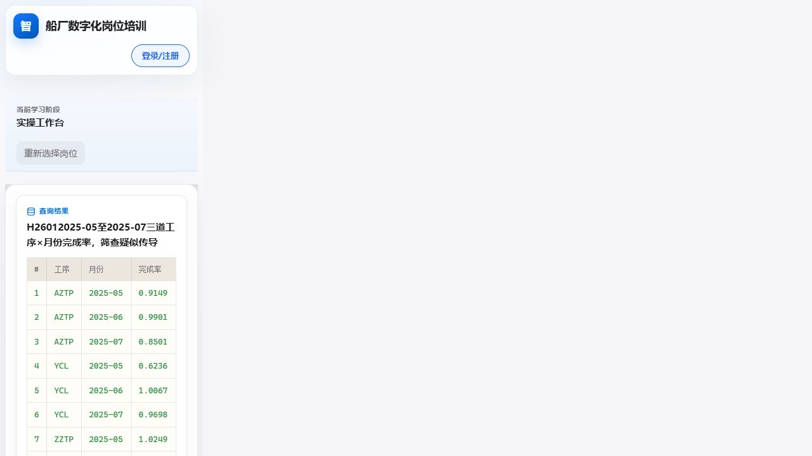

应用档两轮回答：

1. `查询结果第4行最低：工序 YCL，月份 2025-05，完成率 0.6236（62.36%）。`
2. `查询结果对应值为：YCL 2025-05 完成率 0.6236；ZZTP 2025-06 完成率 0.7545；AZTP 2025-07 完成率 0.8501。`

两轮均被老师评价为回答有效，系统给出“已完成至少两轮理解核对”的进入理由，并自动把难度提升到进阶档。

### 15.3 完成进阶档并生成训练报告

进阶档题目要求回看 `2025-04` 至 `2025-07` 的三道工序序列。本次查询仍输出相同三列，只把时间范围改为：

```sql
WHERE ship_no = 'H2601'
  AND period_date >= '2025-04-01'
  AND period_date < '2025-08-01'
```

进阶档两轮回答：

1. `2025-05 的 YCL 完成率最低，为 0.6236（62.36%）；对应查询结果第5行。`
2. `YCL 在 2025-05 的完成率为 0.6236，表示实际完成量仅达到计划量的 62.36%，约有 37.64% 的计划缺口。它是上游异常候选线索，但不能直接认定为根因，还需核查齐套、报工和交接证据。`

最终页面生成“本轮训练报告”，显示：

- 岗前测评：`6/6`；
- 数据查询：`2 次`；
- 最终核对：`4 轮`；
- 结论修正：`无需修正`；
- 最终难度：`进阶档`；
- 当前知识点“三道工序与传导关系”已达到进阶档；
- 下一知识点为“计划量与实际量口径”。


### 15.4 本次手点结论

该路径已验证前端和后端真实连通，覆盖：岗位选择、岗前测评、确定性路由、应用档实操、SQL 白名单与输出契约、两轮理解核对、自动升档、进阶档实操、再次核对、训练报告和下一知识点入口。

本次通过记录只证明这一条具体路径在上述冻结版本可达，不替代三岗位全路径测试、正式 50×2、第二域回归或人工最终复核。

## 16. 三大画像的具体操作流程与实测结果

本节给出三类画像各自最稳妥的操作流程。三条路径均从学员端页面进入，未修改 URL、TRACE、数据库，也未向生产会话注入知识点或模板编号。

### 16.1 新入职生产计划员：SQL、证据核对与完整升档

推荐用途：现场展示 SQL 安全门禁、真实数据查询、证据绑定追问和自动升档。

具体操作：

1. 学员端选择“新入职生产计划员”，关注点保持“由岗前测评自动诊断”。
2. 正常完成岗前测评；页面如出现补充诊断探针，继续按题意作答，不要刷新或重复提交旧探针。
3. 阅读微课后进入实操，根据指南限定的对象、日期、表和输出字段编写只读 `SELECT`。
4. 为展示安全门禁，可先提交一次 `DELETE` 或未授权字段；确认被拦截后再提交正确查询。
5. 查询成功后，每轮回答采用“对象/字段 + 数值 + 业务含义 + 结论”结构。
6. 完成初始档两轮核对后，系统升一档并生成新任务；再次完成查询和两轮核对。
7. 在训练报告中核对最终难度、查询次数、核对轮数、当前知识点和下一知识点。

完整的实际 SQL、回答文本和页面截图见本手册第 15 节。本次实测最终生成进阶档训练报告：


### 16.2 转岗数字化的工艺工程师：关注点、前置依赖与纠错

推荐用途：展示岗位范围约束、人工关注点、确定性前置依赖和历史错误纠正门禁。

具体操作：

1. 选择“转岗数字化的工艺工程师”。
2. 初次演示建议选择“跨工序归因方法”；系统不会直接跳过前置知识，而会根据依赖关系安排必要的口径、完成率或聚合训练。
3. 完成 7 道岗前题与必要探针，记录路由知识点、路由依据和初始难度。
4. 按实操指南提供的查询契约提交 SQL；输出字段必须与指南一致，不要擅自改成中文别名。
5. 第一轮追问可故意把计划量/实际量或最低值说反；观察老师评价是否明确给出纠正依据。
6. 下一轮明确写出正确对象、字段和值，确认历史错误纠正后才允许升档。
7. 完成升档任务后检查报告；本次实测为前测 `7/7`、查询 `2 次`、核对 `4 轮`、结论修正“已完成”、最终“进阶档”。

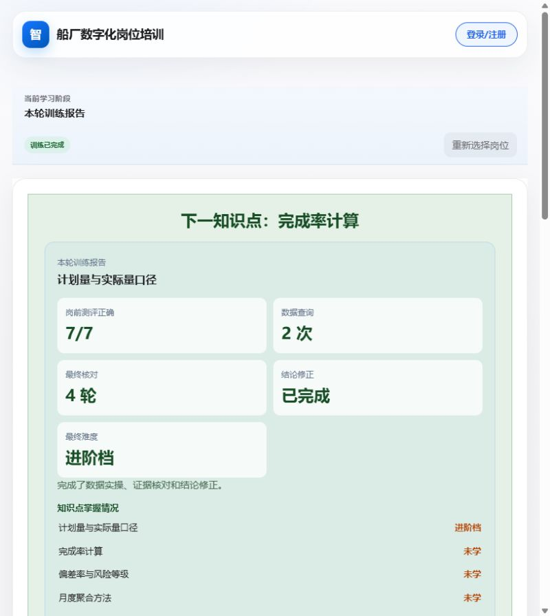

### 16.3 一线班组长：数据直呈、自动代查与进阶核对

推荐用途：展示不要求手写 SQL 的岗位适配、系统代执行只读查询、现场结论转成数据证据，以及升档后的继续训练。

具体操作：

1. 选择“一线班组长（晋升培训）”，首次可保持自动诊断；补学演示可定向选择“异常识别标准”。
2. 完成 5 道岗前题与必要探针。
3. 阅读微课并进入实操。该画像是 `data_present` 模式，学员不填写 SQL；系统代执行经过审核且受沙箱约束的标准只读查询。
4. 初始任务结果中确认最低船号与完成率，用完整证据句回答两轮追问。
5. 系统升到进阶档后应自动执行新的责任单元查询，不应出现空白题目或禁用的手写 SQL 框。
6. 本次修复后的真实手点结果为 `WSB=0.6218`、`WSA=0.6253`，页面继续询问哪一责任单元完成率更低。
7. 继续回答两轮后查看训练报告；此前完整闭环实测为前测 `5/5`、查询 `2 次`、核对 `4 轮`、最终“进阶档”。

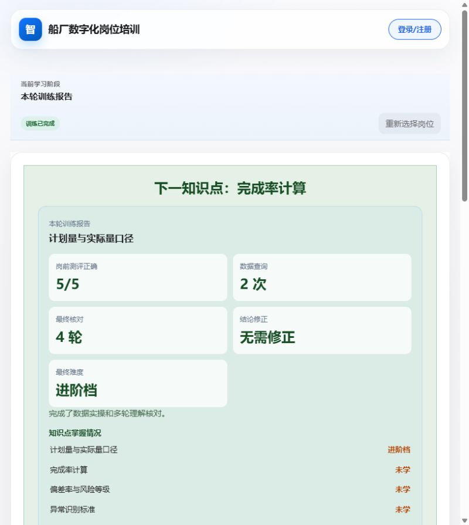

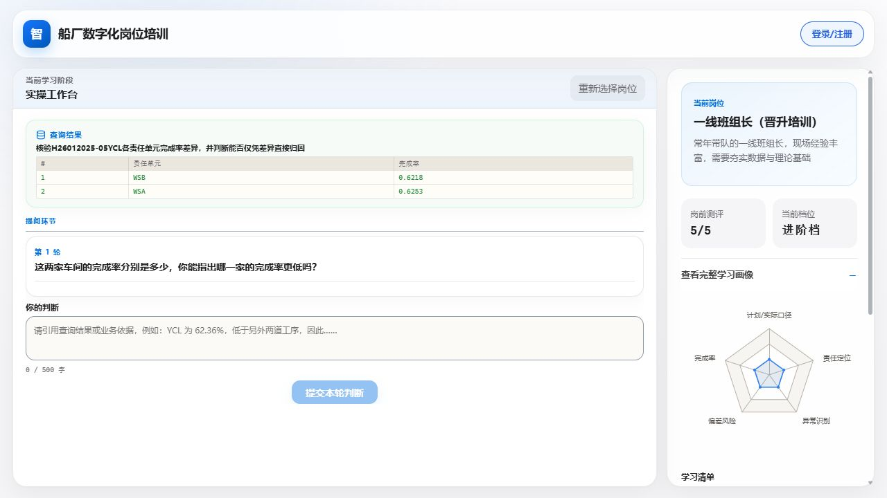

修复后继续完成两轮进阶核对，页面成功生成 `5/5`、查询 `2 次`、核对 `4 轮`、最终“进阶档”的完整训练报告：

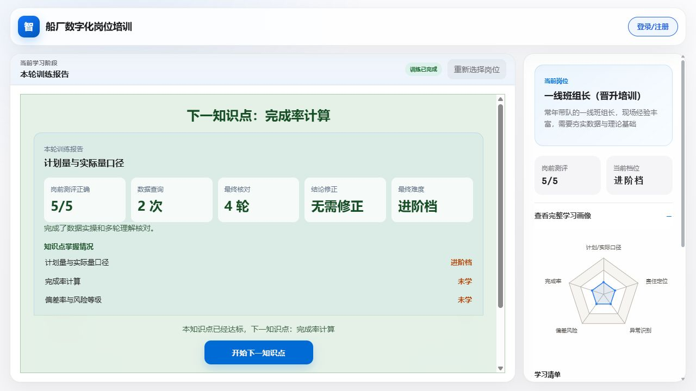

修复验证要点：应用档任务与进阶档任务都必须遵循同一个岗位实操模式。班组长升档后由系统代查；生产计划员和工艺工程师升档后仍保留学员手写 SQL，不得互相串路由。

## 17. 一条覆盖全部 10 个核心知识点的操作路径

### 17.1 先说明“全覆盖”的正确口径

系统的个性化设计不会强迫一个学员在一次会话里机械遍历 10 个知识点。单会话只训练该画像范围内、由诊断或人工关注点选中的知识点；系统级覆盖率则要求 10 个核心知识点都具备三档资源和完整闭环。

因此，下面是一条**同一学员账号、三画像、10 个定向训练会话**的组合全覆盖路径。它既能逐项完成 10 个知识点，又不破坏岗位画像的职责边界。请使用注册学员账号执行；游客模式不会把 10 次训练长期归档到同一账号。


### 17.2 10 个会话的执行顺序

| 顺序 | 选择画像 | 训练关注点 | 本轮主要验证功能 | 完成判据 |
|---:|---|---|---|---|
| 1 | 新入职生产计划员 | 三道工序与传导关系 | 三工序业务链、真实 SQL、证据追问 | 报告显示该知识点已完成 |
| 2 | 新入职生产计划员 | 传导时滞分析 | 月序列比较、传导时差，不把相关性冒充因果 | 报告显示该知识点已完成 |
| 3 | 新入职生产计划员 | 异常衰减规律 | 多月趋势、异常候选与衰减判断 | 报告显示该知识点已完成 |
| 4 | 转岗数字化的工艺工程师 | 月度聚合方法 | 先汇总再计算、月份字段与聚合口径 | 报告显示该知识点已完成 |
| 5 | 转岗数字化的工艺工程师 | 跨工序归因方法 | 前置依赖、反证纠偏、受控归因 | 报告显示该知识点已完成 |
| 6 | 一线班组长（晋升培训） | 计划量与实际量口径 | 计划/实际区分、数据直呈 | 报告显示该知识点已完成 |
| 7 | 一线班组长（晋升培训） | 完成率计算 | `实际量/计划量` 的正确口径 | 报告显示该知识点已完成 |
| 8 | 一线班组长（晋升培训） | 偏差率与风险等级 | 欠产/超产、阈值分档 | 报告显示该知识点已完成 |
| 9 | 一线班组长（晋升培训） | 异常识别标准 | 正常区间、持续性与异常证据 | 报告显示该知识点已完成 |
| 10 | 一线班组长（晋升培训） | 责任单元定位 | 责任单元分组、差异线索与归因边界 | 报告显示该知识点已完成 |

这 10 项的并集恰好是系统的 10 个核心知识点，没有用不属于画像职责范围的强制注入来凑数。

### 17.3 每个会话都重复的标准动作

1. 从“重新选择岗位”进入本表指定画像。
2. 在“训练关注点”下拉框中选择本表指定知识点，点击“开始训练”。
3. 完成岗前测评和必要探针，记录系统给出的路由知识点、初始难度和依据。
4. 阅读微课；SQL 画像按指南查询，班组长画像等待系统代查。
5. 使用结果中的字段和值完成导师核对；有错误时先按评价明确纠正，不能靠复制题目通关。
6. 完成当前档和升档任务，直到生成本轮训练报告。
7. 在完整学习画像中确认该知识点由“待学习/进行中”变为“已完成”，再开始下一会话。

生产计划员、工艺工程师和班组长三段完成后的页面证据分别如下：


### 17.4 最终验收清单

完成 10 个会话后，逐项检查：

- 完整学习画像中 10 个知识点都有已完成记录；
- 每个知识点的报告能追溯到岗位、任务、查询结果、追问评价和最终难度；
- SQL 画像共用安全沙箱，班组长画像始终为数据直呈；
- 没有通过 URL、TRACE、数据库或模板编号强制跳转；
- `deferred` 项不计为已掌握，必须在后续补学会话真正完成后再勾选；
- 若任何会话因模型或外部服务不可用而安全收尾，应重新完成该知识点，不能把安全结束当作掌握。

这条组合路径用于学生手动探索和演示系统级知识覆盖；正式覆盖率仍以冻结 10×3 门禁、TRACE 拆分和人工复核口径计算，不能用手册勾选结果替代正式评测。
