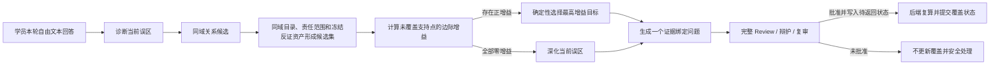

# 创新 B：审核约束的边际误区支持覆盖选靶设计

## 状态与结论

- 状态：已按本规格完成创新 B 实施与单项门禁；A+B 组合门禁及正式 50×2 尚待代码最终冻结后执行。
- 研究类型：AToM 的误区自适应教学思想与 MAAT Diversity Module 的边际覆盖目标，在证据约束追问场景中的模块级融合与改造。
- 实现顺序：创新 A 独立通过后再实施本项。
- 当前不得对外声称：已经提高教学效果、学习成绩或“误区覆盖率”。实现后先证明确定性路由性质；教学效果主张必须另有真实学员或受控学习结果实验，专业人员抽检不能替代教学效果证据。

本项不把现有 `M-01～M-05`、误区共现关系、2～4 轮追问或 Review 重新命名为创新。新增量是把当前“总支持强度优先”的下一误区选择，改成“尚未使用的关联支持知识点边际增益优先”，并且只有审核通过、写入后端交互状态且即将随响应返回的关联追问才进入覆盖历史。

## 一、赛题问题与研究问题

赛题要求系统依据学习交互反馈动态迭代，协同决定降维解释或进阶任务，并探索动态追问与启发式交互导学（`D:\saiti_full_rescan.txt:18-19`）。最高档还要求资源适配、动态决策更新和良好的领域泛化、可迁移能力（`D:\saiti_full_rescan.txt:28,37`）。

当前系统能够根据学员本轮回答诊断误区，也能利用知识切片中的误区关联选择下一目标，但排序仍依据历史共现总强度。它没有回答：

> 在最多 4 轮的有限追问中，如果一个候选误区只会重复已经用过的关联依据，而另一个候选能带来新的关联路由依据，下一轮应优先探查谁？

研究问题定义为：

> 在同域、责任范围、冻结反证证据和 Review 全部满足的前提下，边际支持覆盖能否减少有限轮次中对同一关联路由依据的重复使用，并保持确定性、安全收敛和教学合理性？

## 二、原论文方法

### 2.1 AToM：根据学生误区在线调整教学示例

Ross 与 Andreas 在 ACL 2024 提出的 AToM（Adaptive Teaching tOwards Misconceptions）是一个两阶段概率教学方法：

1. 教师根据学生此前的预测序列，对学生先验参数做最大后验估计，选择最能解释学生历史行为的先验；
2. 在估计出的学生先验下，选择一个教学示例，使学生在看到该示例后对目标概念赋予尽可能高的后验概率。

论文中的两步目标可概括为：

```text
α_i = argmax_α Σ_{j<i} log p_S(student_guess_j | history_before_j, x_j, α)

(x_{i+1}, y_{i+1})
  = argmax p_S(target_concept | history, current_guess,
               x_{i+1}, y_{i+1}, α_i)
```

AToM 的核心是同时“推断学生此前相信什么”和“选择最能纠正未来信念的示例”，而不是固定发放相同材料。

来源：

- [Toward In-Context Teaching: Adapting Examples to Students’ Misconceptions](https://aclanthology.org/2024.acl-long.718/)，ACL 2024，DOI `10.18653/v1/2024.acl-long.718`。

### 2.2 MAAT：质量候选集上的最大边际覆盖

Bi 等人的 MAAT（Model-Agnostic Adaptive Testing）包含：

1. Quality Module：用 Expected Model Change 选择高信息量候选题；
2. Diversity Module：从候选集中选择对当前知识概念覆盖带来最大边际增益的问题；
3. Importance Module：用历史数据估计概念重要性。

MAAT 的 Diversity Module 把重复覆盖视为边际收益递减，并使用贪心最大边际增益选择下一题。论文讨论的是计算机化自适应测试，不是专业培训中的误区追问。

其选择形式可概括为：

```text
q_t* = argmax_{q in Q_C} Δ_q IWKC(Q_T)
Δ_q IWKC(Q_T) = IWKC(Q_T ∪ {q}) - IWKC(Q_T)
```

来源：

- [Quality meets Diversity: A Model-Agnostic Framework for Computerized Adaptive Testing](https://arxiv.org/abs/2101.05986)，ICDM 2020 正式会议论文；所链 arXiv 为作者预印本，正式论文 DOI [`10.1109/ICDM50108.2020.00013`](https://doi.org/10.1109/ICDM50108.2020.00013)。

### 2.3 本项不直接迁移的部分

本系统不复制：

- AToM 的 Bayesian student、先验参数 MAP 估计和目标概念后验；
- MAAT 的 Expected Model Change、认知诊断模型、Importance Module；
- MAAT 的训练数据和完整 CAT 问题池；
- 原论文在固定候选集合下的近似比保证。

本项只借用两个模块级思想：

```text
AToM：下一教学动作应随刚暴露的误区变化
MAAT：有限序列应优先选择带来新增覆盖的候选
```

然后把“学生先验”替换为经结构校验、同域约束并审计留痕的本轮离散误区判断，把“知识概念覆盖”替换为误区关联边背后的批准知识切片支持点。这里不把 Review 冒充 MAAT 的 Quality Module：同域误区目录、当前责任范围和冻结反证资产先构成确定性候选集；选中目标生成的问题随后仍须经过完整 Review。

因此本项是场景化融合改造，不是 AToM 或 MAAT 的完整复现，也不声称改进了它们在原公开基准上的表现。

## 三、现有系统基线

### 3.1 已实现能力

| 能力 | 当前代码证据 | 是否为本项创新 |
|---|---|---|
| 从批准知识切片 `common_mistakes` 派生对称同域关系 | `agents/misconception_relations.py:31-83` | 否 |
| 只选择未探查且受责任范围支持的关联目标 | `agents/misconception_relations.py:95-119` | 否 |
| 按去重知识点支持数、切片支持数排序 | `agents/misconception_relations.py:70-79,112-118` | 否 |
| 模型建议必须等于后端确定性选靶 | `agents/follow_up_agent.py:420-437` | 否 |
| Review 批准并写入待返回交互状态后才把目标写入探查历史 | `orchestrator/interactive_session.py:619-703` | 否 |
| 2～4 轮边界、掌握收敛、第四轮降档 | `orchestrator/interactive_session.py:600-680` | 否 |

### 3.2 当前真实关系

主域由批准切片派生出：

| 关系 | 去重支持知识点 | 切片支持数 | 支持知识点 |
|---|---:|---:|---|
| M-01—M-04 | 2 | 4 | 计划量与实际量口径、完成率计算 |
| M-02—M-05 | 2 | 4 | 三道工序与传导关系、跨工序归因方法 |
| M-01—M-05 | 1 | 1 | 完成率计算 |
| M-04—M-05 | 1 | 1 | 完成率计算 |

`M-03` 无关联边。第二知识域只有 `M-FS01`，没有非平凡关系。

当前基线 `B0` 按关系总支持强度排序。只要目标未探查且当前责任范围支持，它不会判断该关联依据是否已经在前一轮关联选靶中使用过。

## 四、拟议方法

### 4.1 覆盖对象的准确含义

本项中的“支持覆盖”只表示：

> 已经实际使用过的误区关联路径，背后由哪些知识点共同标注提供关系依据。

它不是：

- 学员已经掌握的知识点数量；
- 动态问题正文实际讲完的全部概念；
- 证据引用条数；
- 学习效果或成绩。

该定义用于抑制“下一条关系仍由同一支持点构成”的重复路由，不能被包装成学习覆盖率。

### 4.2 形式化定义

对当前会话第 `t` 轮，定义：

```text
s_t     = 本轮诊断误区
R_t     = 当前任务 responsibility_scope
e=(s_t, m) = 从诊断误区到候选误区 m 的关联边

Support(e)
  = 该关联边由批准知识切片派生的 support_points

EligiblePoints(e, R_t)
  = 按 Support(e) 的稳定顺序保留同时属于 R_t 的点

C_t
  = 此会话此前已经通过 Review、写入后端待返回交互状态的关联路由
    所对应 EligiblePoints 的并集

Gain(e | C_t, R_t)
  = |EligiblePoints(e, R_t) - C_t|
```

候选 `e=(s_t,m)` 必须同时满足：

1. `m` 属于当前域 `misconception_ids`；
2. `m` 尚未被直接探查；
3. `EligiblePoints(e,R_t)` 非空；
4. 当前域 `TaskCatalog` 已通过“每个误区恰有一份冻结 `counter_evidence`”的配置完整性校验；
5. 没有跨域引用或临时补造关系。

### 4.3 排序规则

只保留 `Gain > 0` 的候选，按以下词典序确定性排序：

1. `Gain` 降序；
2. 原有 `knowledge_point_support` 降序；
3. 原有 `chunk_support` 降序；
4. 当前域既有误区顺序。

不引入人工浮点权重，不调用新模型，不让模型选择排序规则。

若全部候选增益为 0：

- 不选择零增益关联目标；
- 复用现有“继续深化当前诊断误区”的路径；
- 不新增结果枚举；
- 不提前伪造掌握；
- 不跨责任范围寻找目标；
- 第 4 轮仍按既有降档规则收敛。

该目标可能以“继续深化同一误区”换取“不跳到一个没有新增关联依据的误区”，因此它不优化目标去重数，也不承诺问题主题一定更分散。

### 4.4 会话覆盖状态

现有 `probed_misconceptions` 只能说明“哪些目标已经批准并提交到交互状态”，不能准确恢复“当时从哪个诊断误区经哪条边选择、该边有哪些支持点”。因此不能用它近似边际覆盖。

会话新增仅后端可见的：

```text
covered_relation_points: set[str]
```

`FollowUpTurn` 内部携带本轮实际选中关系的：

```text
route_support_points: tuple[str, ...]

route_support_points
  = tuple(EligiblePoints(selected_edge, current_responsibility_scope))

无关联边或合法零增益深化
  -> route_support_points = ()
```

更新时机固定为：

```text
动态问题已生成
  -> 确定性门禁通过
  -> 完整 Review / 辩护 / 复审批准
  -> 尚不修改 session
  -> 在局部变量中，根据“最终诊断源 + 最终下一目标 + 当前责任范围”
     重新计算 route_support_points，并完成问题、interaction 和完整性校验
  -> 在同一会话锁内，以不再调用可失败函数的一段赋值，
     原子提交 question / artifact / interaction /
     probed_misconceptions / covered_relation_points /
     processed_turn_ids
     其中 new_covered = old_covered ∪ route_support_points
```

`route_support_points` 不接受 LLM 输出，也不信任被驳回草稿携带的值。首次生成和同一审核循环内的每次重生成必须读取同一份只读 `covered_relation_points` 快照，并保持同一个确定性路由结果；最终提交时由后端重新计算。

原子提交的实现边界固定为：

1. 在修改 session 前，先用局部变量完成最终路由支持点复算、公开问题校验和 `interaction` 构建；
2. 上述任一步骤失败，`question / artifact / interaction / probed_misconceptions / covered_relation_points / processed_turn_ids` 全部保持原值；
3. 第一次修改 session 之后不得再调用任何可能失败的函数；
4. 最终六类状态在现有 `follow_up_lock` 内以一段无异常赋值提交。

以下内容不得更新覆盖：

- Review 驳回草稿；
- 重生成失败草稿；
- 尚未写入待返回交互状态的问题；
- 无关联边的“继续深化当前误区”；
- 幂等重放的同一次提交；
- 其他会话或其他知识域的数据。

开始新的自由追问会话时，与 `probed_misconceptions` 同时清空。

### 4.5 示例

该示例只允许使用实际责任范围为 `{完成率计算, 计划量与实际量口径}` 的 `T-02` 或 `T-02-A`。不得把 `T-01` 用作该示例，因为 `T-01` 的实际责任范围只有 `{计划量与实际量口径}`，无法产生下面两个支持点。

在 `T-02` / `T-02-A` 的真实责任范围内，关系可能形成：

```text
首次诊断 M-01
  -> 先直接确认 M-01

M-01 再次未掌握
  -> 选择 M-04
  -> 记录该路由的支持点：
     {计划量与实际量口径, 完成率计算}

随后 M-04 仍未掌握
  -> 候选 M-05 只由 {完成率计算} 支持
  -> 边际增益为 0
  -> 不重复跳到 M-05，继续深化 M-04
```

这个例子只证明系统没有重复使用同一关联路由依据做零增益跳转；它不证明 M-04 继续深化比转到 M-05 更能提高学习效果。专业人员只能抽检变化路径中的题目、答案和证据是否专业正确，教学效果须由独立学习结果实验验证。

### 4.6 数据流



## 五、组件边界

预计生产代码触点：

- `agents/misconception_relations.py`
  - 保留现有 `rank_related_targets()` 作为 B0 总支持强度基线；
  - 增加返回关系及其正边际支持点的纯函数；
  - 保持关系派生、同域过滤和稳定顺序。
  - 增加专用 `RelationIntegrityError`，只表示索引损坏、未知支持点或跨域覆盖状态；合法空关系不得抛该异常。
- `agents/follow_up_agent.py`
  - 接收只读 `covered_relation_points`；
  - 根据边际增益确定唯一下一目标；
  - 在内部 `FollowUpTurn` 返回本轮关系支持点；
  - 模型返回仍须等于后端确定性目标。
- `orchestrator/interactive_session.py`
  - 维护并清空会话级覆盖状态；
  - 首次生成与审核驳回后的重生成读取同一份覆盖快照；
  - 只在问题批准并写入待返回交互状态后，由后端复算关系支持点并提交更新；
  - 所有可能失败的准备工作先在局部变量完成，再保持幂等和锁内无异常原子更新。
  - 显式捕获 `RelationIntegrityError`，复用现有 `_finish_system_error()`，提交 `client_turn_id` 后安全终止；不得让原始异常落到 HTTP 400/500。
  - 增加只在后端内部注入的 `RoutingPolicy(total_support | marginal_support)`；生产默认冻结为 `marginal_support`，不进入前端、环境变量或学生配置。
- `agents/prompts/follow_up.md`
  - 说明问题必须服从后端确定的“下一探查目标”；它可能是新的关联误区，也可能在无正增益时继续深化当前误区，模型不得自行扩展或强制换目标。
- `eval/run_innovation_b_routing_ablation.py`
  - 纯确定性地加载正式任务目录、批准关系索引和预定义 answer-diagnosis 历史；
  - 通过同一 `RoutingPolicy` 分别运行 B0/B1 可达状态树；
  - 不实例化 LLM，不修改生产资产。

预计测试触点：

- `eval/test_misconception_relations.py`
- `eval/test_follow_up_agent.py`
- `eval/test_p5_interactive_follow_up.py`
- `frontend/src/lib/interactiveApi.spec.ts`
- `frontend/src/lib/tracePresentation.spec.ts`
- `frontend/src/components/LivePractice.spec.ts`

明确不改：

- R-01～R-05 和 ReviewAgent；
- S-01～S-09；
- 21 条状态转移；
- 升降档、T18 和第四轮收敛；
- 三指标公式与正式 runner；
- 前端交互结构；
- 第二域关系资产。

内部覆盖状态不进入学员响应，不新增公开协议字段。后端只能证明问题已经批准并写入即将返回的交互状态；由于当前 HTTP 协议没有浏览器渲染 ACK，不得声称后端已经确认学员实际看见。直接方法证据由纯函数消融报告、测试和现有诊断/下一目标 trace 联合形成。

同版消融产物固定落盘为：

- 机器可复算结果：`eval/results/innovation_b_routing_ablation.json`；
- 内部解释报告：`docs/内部说明_边际误区关联选靶消融.md`。

两者均为内部核验材料，不进入学员公开界面；报告必须记录冻结任务、可达历史前缀、相同轮次与诊断固定桩、批准覆盖来源、B0/B1 第一次分叉及其直接确定性后果。专业正确性抽检如有，应作为独立附录记录，不进入算法采用结论。

可复算命令固定为：

```text
python eval/run_innovation_b_routing_ablation.py --output eval/results/innovation_b_routing_ablation.json
```

JSON 至少包含：

```text
schema_version
tasks[]:
  template_id
  responsibility_scope
  reachable_history_prefix
  b0_target
  b1_target
  b0_route_support_points
  b1_route_support_points
  first_divergence
summary:
  different_route_support_points
  zero_gain_relation_hops
  cross_domain_targets
  out_of_scope_targets
```

输入必须来自正式目录和仓库内冻结固定桩；脚本不得接受临时关系、任意覆盖集合或 LLM 输出作为采用证据。

## 六、失败与边界处理

- **合法空关系**（单节点域、当前源无边、责任范围交集为空或全部增益为 0）：深化当前误区，不跨域借关系。
- **运行时关系完整性错误**（关系索引损坏、未知支持点、覆盖状态跨域）：抛专用 `RelationIntegrityError`，不得伪装成合法零增益或裸露为 `ValueError`；交互管理器显式捕获后沿用现有 `system_error` 安全停止、内部错误留痕并登记本次 `client_turn_id`。
- **`TaskCatalog` 反证资产缺失**：保持现有配置加载期硬失败，不进入候选排序；交互创建边界继续转为既有安全错误，不由本项临时补造资产。
- 模型提出的下一目标与确定性结果不一致：拒绝生成。
- Review 驳回或生成失败：不更新探查目标和覆盖历史，不显示草稿。
- 全部增益为 0：深化当前误区，不为了“看起来更智能”强制换目标。
- 达到第 4 轮：无条件遵守现有安全收敛。
- UI 不显示误区编码、关系、覆盖、增益、节点、边、路由或字段名。
- 完整性错误后的同一 `client_turn_id` 重放：直接返回既有终止态，不得再次生成、审核或抛出原始异常。

## 七、验证设计

### 7.1 实施前离线采用门

先从真实初始任务和最多 4 轮追问规则构造**可达状态树**，而不是对任意集合做笛卡尔积。每个状态必须由一个真实历史前缀生成：

```text
固定真实任务及其 responsibility_scope
  -> 预定义 answer-diagnosis 固定桩
  -> 按当前路由产生下一目标
  -> 仅在模拟 Review 批准后提交 probed 与 covered
  -> 进入下一轮，直到第 4 轮收敛
```

可达性约束：

1. `covered_relation_points` 只能来自此前真正获得 Review 批准并完成后端状态提交的关系追问；
2. 该边目标必须对应当时已经提交的探查目标；
3. 被驳回草稿不得产生覆盖状态；
4. `probed_misconceptions`、覆盖状态、剩余轮数和历史前缀必须相互一致；
5. B0/B1 使用完全相同的历史前缀、轮次、诊断结果和预定义 answer-diagnosis 固定桩；
6. 若路由首次分叉后将导致不同后续问题，只比较第一次分叉及其直接确定性后果，不得把分叉后的 LLM 随机输出混入算法差异。

B0/B1 必须在同一冻结代码上通过内部 `RoutingPolicy` 切换：`total_support` 调用保留的现有排序，`marginal_support` 调用新增纯函数；不得通过改代码、改关系资产或 monkeypatch 伪造成对实验。

只有同时满足以下条件才允许接入生产：

1. 至少存在一个真实可达场景，`B1` 与当前 `B0` 的选靶不同；
2. 相同轮数下，B1 的不同关联路由支持点累计数量不低于 B0；
3. 至少一个场景严格减少零增益关联跳转；
4. 两个策略的分叉前历史、轮次、诊断结果和 answer-diagnosis 固定桩完全一致；
5. 每个覆盖点均可追溯至此前真实 Review approve 和后端提交记录；
6. 第一次分叉后的比较只包含选靶、边际增益和支持点等直接确定性后果；
7. B1 选出的候选仍通过既有 Review、证据绑定、同域、责任范围和确定性约束；
8. 不使用临时关系、任意覆盖集合、分叉后 LLM 输出或 monkeypatch 制造差异；
9. 若路径变化为 0，或固定桩消融不能证明严格减少零增益关联跳转，本项停止，不为凑创新强行上线。

专业人员对变化路径中测试题、标准答案和证据引用的抽样正确性检查不属于上述算法采用门。它只承担专业事实质量保障，不证明教学有效性，也不用于替代固定桩消融和确定性约束。

### 7.2 先写失败测试

关系算法必须覆盖：

- 最大正增益优先；
- 已覆盖支持点不再贡献增益；
- 全部零增益返回无关联候选；
- 并列顺序稳定；
- 无自环、无跨域、无责任范围外目标；
- 同样输入重复运行结果完全一致。

交互必须覆盖：

- 首次诊断仍先确认当前误区；
- 在 `T-02` 或 `T-02-A` 的实际责任范围内，`M-01 -> M-04` 后，`M-04 -> M-05` 因零增益被抑制；
- 被驳回草稿不进入覆盖；
- 批准并写入待返回交互状态后只更新一次；
- 首次生成与同一审核循环内所有重生成共享同一覆盖快照和路由支持点；
- 最终提交由后端根据最终三元组和责任范围复算，拒绝信任草稿或模型提供的支持点；
- 注入最终提交准备失败时，question / artifact / interaction / probed / covered / processed 六类状态全部保持原值；
- 注入跨域 covered、未知 support point 或损坏关系索引：进入既有 done/system_error 教学化终止态，HTTP 不返回 400/500 或原始异常；同一 `client_turn_id` 重放不再触发生成或审核；
- 同一 `client_turn_id` 重放不重复更新；
- 新会话清空覆盖；
- 2～4 轮、升档、降档和安全停止不变；
- 第二域完整固定桩会话中，B0/B1 的公开问题、目标、模型调用次数、公开 trace 字段和最终状态完全一致，覆盖状态始终为空；
- A+B 组合压力：A 的两次驳回重生成期间 B 的覆盖快照不变；最终 approve 只提交一次，`refuse` / `ReviewFlowInterrupted` / `system_error` 均零提交；
- 前端 DOM、ARIA、通知和导出教学视图零工程术语。

所有开发期后端测试必须带 `-k "not live"`，不调用真实模型。

### 7.3 消融指标

对照：

```text
B0：当前总支持强度排序
B1：正边际支持覆盖排序
```

对应内部策略分别为 `RoutingPolicy.total_support` 与 `RoutingPolicy.marginal_support`。

确定性指标：

- 不同关联路由支持点数；
- 零增益关联跳转数；
- 重复支持点贡献数；
- 路由确定性；
- 跨域目标数，必须为 0；
- 责任范围外目标数，必须为 0；
- 无冻结证据目标数，必须为 0；
- 未批准草稿污染覆盖数，必须为 0；
- 第 4 轮未收敛数，必须为 0。

这些指标只证明路由算法性质，不证明学习成绩提升。

### 7.4 专业正确性抽检与教学效果边界

实现冻结后，专业人员可抽检发生变化路径中的：

- 测试题是否符合船舶生产业务语义；
- 标准答案是否专业正确；
- 证据是否足以支持问题和答案；
- 是否存在明显跨范围、错口径或错误因果表述。

结果按样本逐例保留，作为专业事实质量记录。该抽检：

- 不是 B 生产启用硬门禁；
- 不参与 B0/B1 算法优劣判定；
- 不证明“深化当前误区”比切换误区更有效；
- 不证明学习成绩或教学效果提高。

如需主张教学效果，必须另行设计真实学员或受控学习结果实验，并与本项确定性路由验收分开报告。

### 7.5 版本级回归

本项独立通过后执行：

```text
聚焦后端测试 -k "not live"
全量后端测试 -k "not live"
前端测试与构建
第二知识域完整交互固定桩回放、Agent 级与关系纯函数固定桩
创新 A + B 组合压力集
公开文本扫描
禁止修改项 git diff 核验
```

正式 50×2 只在两项创新全部完成、代码冻结后运行一次。它只承担系统版本的幻觉率、覆盖率和适配率不回退证明，不作为本选靶方法的直接证据，也不表述为证明两域整体能力。

## 八、第二知识域与迁移边界

第二域当前只有 `M-FS01`，无非平凡关系，因此必须表现为：

- 关系候选为空；
- 覆盖集合为空；
- 稳定深化当前误区或走既有收敛；
- 不出现主域 `M-01～M-05`；
- 不新增模型调用；
- 与 B0 在公开问题、目标、模型调用次数、trace 公开字段和最终状态上观察等价。

为证明上述等价，测试使用 `_DemoRuntime` 现有 `task_agent` 注入口构造第二域 test-only 会话 fixture，并完成非终止追问到既有收敛的 B0/B1 固定桩回放；同时执行 Agent/关系函数测试及 domain-swap 回归。不得仅以关系纯函数空结果替代完整交互断言，也不为此新增生产环境领域切换接口。

第二域迁移不回退证据必须独立成组报告，不与正式 50×2 的三指标结果合并成“整体两域能力”结论。

第二域可以证明：

- 算法依赖领域配置而非主域硬编码；
- 稀疏或单节点域能够安全退化；
- 不发生跨域关系泄漏。

第二域不能证明：

- 边际选靶在另一个多误区域同样增加不同关联路由支持点；
- 跨行业泛化；
- 自动零样本形成新误区关系。

如需验证算法在其他图结构上的一般性质，可以使用纯测试合成关系 fixture，但必须标明它是算法测试，不能冒充第二域真实业务收益。

## 九、对赛题的直接增益

| 赛题要求 | 本项解决方式 |
|---|---|
| 基于交互反馈的动态迭代 | 下一目标由本轮诊断和已使用关系依据共同决定 |
| 动态追问与启发式导学 | 不再只问“最强关联”，而是优先使用有限轮次中尚未使用的关联路由依据 |
| 个性化资源适配 | 不同学员的诊断序列和已覆盖历史形成不同追问路径 |
| 分析—生成—校验—决策闭环 | 先诊断、后确定性选靶、再证据生成与 Review，批准后才提交路径状态 |
| 领域泛化与可迁移 | 关系和误区来自领域配置；第二域证明安全退化和零串域 |

本项针对赛题最明确的“动态追问与启发式交互导学”评分点。它的价值不在误区节点数量，而在于给出一个可解释、可复算、有限轮次下避免重复使用关联依据做零增益跳转的决策目标。

## 十、可主张与不可主张

实现并验证后可以主张：

> 受 AToM 误区自适应教学和 MAAT 边际知识覆盖思想启发，提出审核约束的边际误区支持覆盖选靶：在同域、责任范围和冻结反证证据内，优先选择带来新增关联路由支持点的误区；只有 Review 批准并写入后端待返回交互状态的问题，才由后端复算并提交覆盖状态。

不得主张：

- 实现或改进了完整 AToM；
- 实现了 MAAT 的 EMC、Importance Module 或完整 CAT；
- 继承 MAAT 的近似比保证；
- 五节点关系是知识图谱；
- 支持点覆盖等于学员掌握度或学习成绩；
- 第二域已经证明多节点选靶收益；
- 在没有真实学员或受控学习结果实验前声称教学效果已经提高；
- 把专业人员对题目、答案和证据的正确性抽检包装成教学有效性证据。
