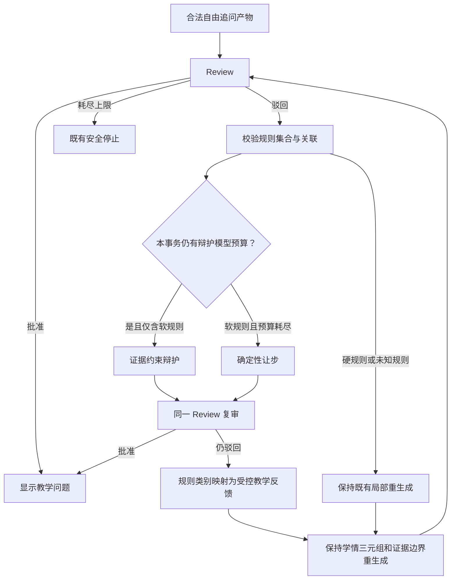

# 创新 A：事务级选择性辩护与受控反馈再生成

## 状态与一句话结论

- 状态：已审批，按最新交付代码的权威 A0 语义进入实施。
- 研究类型：受 SELENE“按需启动辩论”原则启发，针对证据约束教学审核闭环提出的场景化方法。
- 适用范围：只作用于自由追问产物的审核循环；讲义、任务、实操结果等既有生产路径保持不变。
- 当前不得对外声称：已经降低真实模型成本、提高审核通过率或提高教学效果。实现后可先证明确定性控制性质；真实效果必须另有真实交互证据。

本项新增两个相互独立、可以做消融的模块：

1. **事务级一次辩护模型预算**：同一次自由追问审核事务中，最多尝试一次 LLM 辩护；后续合法驳回仍完整经过“确定性让步—复审—重生成或安全停止”，把当前最多 4 次辩护模型调用的上界收紧为 1 次。
2. **受控审核反馈再生成**：把最终驳回的规则类别映射成白名单教学修改要求，交给下一版问题生成；不把审核原文、规则号、证据编号或工程字段送给生成模型，更不送到前端。

它改进的是**本系统当前的协同分配和驳回后再生成方式**，不是对 SELENE 原公开基准算法的直接改进，也不是 SELENE 全方法复现。

## 一、赛题问题与研究问题

赛题要求：

- 多角色相互协同决策；
- 通过辩论与交叉验证减少专业领域幻觉；
- 根据学习交互动态追问和调整教学；
- 形成分析、生成、校验、决策闭环。

对应原文见 `D:\saiti_full_rescan.txt:17-19,28-33`。

当前系统已经有真实 Review—辩护—复审闭环，但自由追问路径仍有两个方法层缺口：

1. `audit_and_review()` 最多循环 4 次；每次软规则驳回都会再次调用辩护模型。系统没有利用“本事务已经辩过一次、仍未解决”的审核历史。
2. 复审仍驳回后，下一版问题只收到固定的“重新组织”提示，没有利用审核已经识别出的错误类别。

研究问题是：

> 在不放宽 R-01～R-05、不跳过复审、不改变 2～4 轮学习收敛和三项学情不变量的前提下，能否把“每次生成循环均可调用辩护模型”收紧为“每个自由追问审核事务最多尝试一次辩护模型调用”，并用受控审核类别指导后续再生成？

## 二、原论文方法与启发边界

### 2.1 SELENE 的 Selective Debate Initiation

Verma 等人在 EACL 2026 提出的 SELENE 包含两个模块：

1. **Selective Debate Initiation（SDI）**：多个智能体先独立作答并给出自报置信度；系统计算回答间语义分歧 `D`，以及自报置信度与回答内在似然之间的失配 `M`。两项信号都低时跳过辩论，否则进入有界辩论。
2. **Evidence-Weighted Self-Consistency（EWSC）**：对需要更稳健判断的案例，以不同证据变体重复判断，再按判断方差和证据一致性聚合。

SDI 可概括为：

```text
D = 2 / [N(N-1)] * Σ(i<j) [1 - cos(E(r_i), E(r_j))]
M = 1 / N * Σ_i |c_i - sigmoid(log p(r_i | q))|

D < τ_D 且 M < τ_M  -> 跳过辩论
否则                  -> 进入有界辩论
```

原方法的核心不是“必须辩论”，而是**协同强度应按实例分配**。论文也说明 logits、置信度校准和阈值可能随模型变化而漂移。

来源：

- [SELENE: Selective and Evidence-Weighted LLM Debating for Efficient and Reliable Reasoning](https://aclanthology.org/2026.eacl-industry.7/)，EACL 2026，DOI `10.18653/v1/2026.eacl-industry.7`。

### 2.2 相关边界证据

- [Should we be going MAD?](https://proceedings.mlr.press/v235/smit24a.html) 表明多智能体辩论并不天然优于其他推理策略，而且对配置敏感。因此“每次驳回都再次辩论”本身不能作为能力证据。
- [Stay Focused: Problem Drift in Multi-Agent Debate](https://aclanthology.org/2026.findings-eacl.268/) 研究多轮辩论偏离原问题的风险。本系统既有三项学情不变量只能约束本项目中的学习决策漂移，并不等同于复现该论文的 DRIFTJudge 或 DRIFTPolicy，也不能覆盖论文定义的全部问题漂移。

### 2.3 本项如何借鉴，而不是照搬

本系统不复制：

- 多个智能体并行生成候选答案；
- logits、自报置信度和 embedding 阈值；
- EWSC 的证据变体并行裁决；
- SELENE 的公开数据集、准确率或 token 降幅结论。

原因是本系统面对的不是通用问答共识，而是：

> 一个已绑定证据的教学问题被 Review 驳回后，本次审核事务还值得投入多少次辩护，以及下一版问题应如何受控修正。

本项把 SELENE 的“实例级选择性协同”原则场景化为：

```text
SELENE：由回答分歧和置信失配决定是否启动辩论
本系统：由审核规则性质、事务内辩护历史和固定预算决定是否再次调用辩护模型
```

这是**受 SDI 思想启发的领域化审核后协同门控**，不得表述为“直接改造 SDI 算法”或“改进 SELENE”。

## 三、当前系统基线与真实增量

| 能力 | 当前代码证据 | 是否为本项新增 |
|---|---|---|
| R-02/R-03 可调用 LLM 辩护，其他规则确定性让步 | `agents/rebuttal_generator.py:16,134-149` | 否 |
| 每次 reject 都生成辩护并复审 | `orchestrator/review_flow.py:104-119` | 否 |
| 最多 4 次生成—审核循环 | `orchestrator/review_flow.py:99-129` | 否 |
| 追问再生成接收 `review_feedback` | `agents/follow_up_agent.py:267-279,370-374` | 否，接口已存在 |
| 当前追问再生成只传固定泛化提示 | `orchestrator/interactive_session.py:727-735` | 是，本项要解决 |
| 再生成必须保持 assessment / diagnosed / next-target 三元组 | `orchestrator/interactive_session.py:742-756` | 否，既有安全边界 |

当前基线记为 `A0`：

```text
每个生成循环：
  Review reject
    -> 若全部命中属于 R-02/R-03，调用 LLM 辩护并完整复审
    -> 若命中硬规则、未知规则或混合未知规则，保持 fail-closed 局部重生成，
       不对必然失败的同一产物增加一次让步和复审
    -> 下一循环用固定泛化提示重生成
```

拟议方法记为 `A1`：

```text
同一自由追问审核事务：
  软规则第一次驳回且辩护预算未使用
    -> 调用一次 LLM 辩护
  后续 R-02/R-03 驳回
    -> 确定性让步并完整复审

  硬规则、未知规则或混合未知规则
    -> 保持 A0 的 fail-closed 局部重生成

  每一次让步仍必须完整复审
  复审仍驳回
    -> 将规则类别映射为白名单教学修改要求
    -> 保持三项学情决策不变地重生成
```

### 被否决的旧备选

不采用“证据结构完整则辩、结构不完整则让步”作为核心创新。当前 `FollowUpAgent` 已强制非空问题、非空标准题干，并直接由同一证据集合生成完全一致的 `evidence_refs`；Review 对合法追问产物的结构检查与此同构。该门控在真实合法产物上几乎没有独立判别力，只能依靠手造畸形 fixture 产生差异，不能作为真实创新。

## 四、拟议方法

### 4.1 审核事务

一次学员自由文本提交触发的 `_review_follow_up_product()` 定义为一个审核事务 `τ`。事务范围覆盖当前提交对应的首稿及最多 3 次重生成，共最多 4 个生成—审核周期。

事务状态只在后端内存中存在：

```text
rebuttal_attempts_τ: int = 0
last_feedback_τ: tuple[str, ...] = ()
```

它在下一次学员提交、新会话或安全终止时重新初始化，不跨学员、不跨会话、不形成全局学习参数。

### 4.2 规则集合与合法性

对合法 reject verdict `v` 定义：

```text
H(v) = 按固定顺序去重后的 rule_id 集合
```

门控不读取中文 `reason`，不读取模型自由文本，不根据证据编号做阈值判断。

- product—verdict 关联不合法：沿用现有异常和 fail-closed。
- `H(v)=∅`：这是非法 reject verdict；零辩护模型调用，不伪造 concession 或 re-verdict，沿用 `ReviewFlowInterrupted` 安全停止。
- `H(v)` 非空但含硬规则、未知规则或混合未知规则：保持 A0 的 fail-closed 局部重生成，不生成让步、不执行同产物复审，也不消耗辩护模型预算。

### 4.3 事务级一次辩护模型预算

自由追问审核事务固定：

```text
B_τ = policy.rebuttal_budget
生产默认 B_τ = 1
Soft(v) = H(v) 非空 且 H(v) ⊆ {R-02, R-03}

Debate(v, τ)
  = FollowUpProduct(v)
    且 Soft(v)
    且 rebuttal_attempts_τ < B_τ
```

处理顺序：

1. 先验证 product—verdict 关联，非法即沿用现有异常和 fail-closed。
2. `H(v)=∅` 时直接安全停止；不得构造一个 ReviewAgent 无法接受的空命中复审。
3. `Debate(v,τ)=true`：
   - **先**在事务内原子预占 `rebuttal_attempts_τ += 1`；
   - **再**调用现有 `RebuttalGenerator`；
   - 每次尝试都消耗一个预算单位，包括模型主动让步、超时、异常或非法输出；生产默认 `B_τ=1`，因此首次尝试后即耗尽。模型异常继续沿用现有安全停止，不在本事务内重试；
   - 辩护只能引用当前产物已有证据。
4. 对已经由现有争议路由判定为 R-02/R-03 的驳回，`Debate(v,τ)=false` 时：
   - 在同一关联校验通过后，生成现有协议格式的确定性 `concede=true` 消息；
   - LLM 辩护调用数不增加。
5. R-02/R-03 两条分支只要成功产生合规 rebuttal 消息，就必须将其写入审计链，并调用同一个 `ReviewAgent.re_review()`；调用前异常则按既有中断路径安全停止。
6. 硬规则、未知规则和混合未知规则继续由现有 `local_regeneration` 路由处理；创新 A 不改变该路径，也不调用新增确定性让步入口。
7. 门控自身无权批准产物，也无权跳过 R-02/R-03 路径的复审。

这里受控的只是**辩护分支**，不是全部模型协同：Review、re-review 和下一版问题生成仍按既有逻辑执行。非自由追问产物保持当前 `DEFENSIBLE_RULES` 行为，不受本事务预算影响。

### 4.4 为什么是“一次”，而不是零次或四次

- 不是零次：保留一次真实的跨智能体申诉机会，允许 Review 的语义误判被同一证据边界内的解释纠正。
- 不是四次：第一次辩护和复审仍未解决后，继续对同一学员提交反复争辩的边际价值缺乏证据；后续应把预算用于受控重生成。
- 固定为整数 1：不引入人工浮点权重、模型置信阈值或跨会话历史漂移；可以通过固定桩完全复算。

该预算只保证“每个自由追问审核事务尝试调用辩护模型不超过 1 次”，不保证真实 token 总量必然下降，因为 Review、re-review 和问题再生成仍可能波动。

### 4.5 受控审核反馈

只有复审仍驳回、即将进入下一次问题生成时，才生成反馈。反馈来源是**已经由 `runtime.audit()` 接受并写入审计链的最终 re-review verdict**；不得直接保存 `re_review()` 尚未审计的原始返回值，也不得使用已经被复审推翻的初审理由。

实现采用 pending—commit 边界：

```text
pending_re_verdict = ReviewAgent.re_review(...)
audited_re_verdict = runtime.audit(pending_re_verdict)

若 audited_re_verdict.role == re_verdict
且 decision == reject
且关联仍合法
  -> last_feedback_τ = whitelist_map(audited_re_verdict.rule_hits)
否则
  -> 不提交新反馈
```

交叉关联、非法或审计失败的 re-verdict 不得污染下一轮反馈。

规则按固定顺序去重并映射：

| 内部规则 | 传给下一版生成的教学修改要求 |
|---|---|
| R-01 | 让题目中的数据口径与当前学习任务保持一致。 |
| R-02 | 让问题与所给专业材料之间的支持关系更明确。 |
| R-03 | 保持学习目标和既定难度档不变，调整问题的表达、铺垫和认知负荷。 |
| R-04 | 只使用已经提供且能够核验的材料重新组织问题。 |
| R-05 | 只围绕已经确认有效的学习结果重新组织问题。 |
| 未知规则或映射异常 | 上一版问题未通过专业审核，请重新组织。 |

明确禁止作为反馈传给**下一版问题生成模型**：

- 原始 `reason`；
- `R-01～R-05` 字样；
- `msg_id`、`rule_hits`、`evidence_ref` 等协议字段；
- 状态机、转移、异常类名；
- 审核智能体身份和内部争辩文本。

这些反馈只进入下一版问题的内部生成上下文，不新增前端文案、状态、分类或按钮。

首次可辩驳回仍沿用现有 `RebuttalGenerator`：辩护智能体可以读取审核理由以完成申诉，但该理由不得越过辩护边界流入下一版问题生成或前端。

### 4.6 学情语义与证据边界不变

审核反馈只能帮助改写问题，不能重新决定学习路径。每次再生成继续满足：

```text
assessment                   == initial.assessment
diagnosed_misconception      == initial.diagnosed_misconception
next_target_misconception    == initial.next_target_misconception
responsibility_scope         == initial.responsibility_scope
evidence_refs                来自最终目标的冻结证据
```

任一学情字段漂移、证据越界或公开工程术语命中，立即 fail-closed，不显示失败草稿。

## 五、数据流



## 六、组件边界

预计生产代码触点：

- `agents/rebuttal_generator.py`
  - 提取共享 `_validate_rejection_context(product, verdict)`，模型辩护与确定性让步都必须先通过同一 trace、消息、payload 和 reviewed-object 关联校验；
  - 增加显式的确定性让步入口，复用现有 rebuttal 消息契约，但不得绕过共享关联校验；
  - 不改变 R-02/R-03 首次辩护的模型、证据边界和输出校验。
- `orchestrator/interactive_session.py`
  - 在 `_review_follow_up_product()` 的局部闭包内维护 `rebuttal_attempts`；
  - 辩护模型调用前原子预占预算；
  - 向 `audit_and_review()` 传入 `audit_with_feedback_capture` 包装器：先调用 `runtime.audit(message)`，只在其成功返回合法 reject `re_verdict` 后提交最终规则类别反馈；不得包装或保存 `re_review()` 原始返回值；
  - 再生成时只传白名单反馈；
  - 预算和反馈不进入公开 session state。
  - 增加仅后端内部可注入、默认冻结为新方案的 `FollowUpReviewPolicy`：

    ```text
    rebuttal_budget: 0 | 1 | 4
    feedback_mode: mapped | generic
    ```

    该对象只用于确定性消融和预算敏感性测试，不进入前端、环境变量或学生可配置项；生产默认固定为 `1 + mapped`。
- `agents/prompts/follow_up.md`
  - 明确审核反馈只允许修改表达、铺垫和认知负荷；
  - 不得改变后端确定的学习判断、目标、难度档或证据边界。

预计测试触点：

- `eval/test_debate_runtime.py`
- `eval/test_p5_interactive_follow_up.py`
- `eval/test_follow_up_agent.py`
- `frontend/src/lib/interactiveApi.spec.ts`
- `frontend/src/lib/tracePresentation.spec.ts`
- `frontend/src/components/LivePractice.spec.ts`

明确不改：

- `agents/review_agent.py` 的 R-01～R-05 判定和阈值；
- `orchestrator/review_flow.py` 的公共协议和复审义务；
- `orchestrator/engine.py` 和 21 条状态转移；
- S-01～S-09；
- `eval/metrics/` 和正式 runner；
- 前端业务流程与可见文案分类。

## 七、失败和安全处理

- product—verdict 关联异常：沿用现有异常，不产生 rebuttal 消息。
- 空命中 reject：零模型调用，不伪造确定性让步或 re-verdict，沿用 `ReviewFlowInterrupted` 安全停止。
- 非空未知规则或 `R-02 + R-99` 等混合未知规则：不得因含 R-02 而误入模型辩护；保持既有 fail-closed 局部重生成，零让步、零复审、零预算消耗。
- 预算耗尽分支遇到 cross-wired verdict：共享关联校验失败，安全停止且不产生 rebuttal 消息。
- 第一次辩护模型异常：沿用 `ReviewFlowInterrupted` 和现有安全停止，不偷偷改为成功。
- 反馈映射异常：使用既有泛化反馈；若 verdict 结构本身不合法或未通过审计则安全停止。
- 4 次生成循环耗尽：沿用既有 `refuse` 安全收尾，不展示最后失败草稿。
- 所有公开界面继续禁止出现规则号、协议字段、状态机代号、转移名或异常类名。

## 八、验证与消融

### 8.1 先写失败测试

测试必须使用**由 `FollowUpAgent` 固定桩生成、结构合法且证据绑定完整的真实协议产物**，不得靠删字段的畸形 fixture 制造采用差异。

必须覆盖：

1. 三个连续合法追问草稿：第一、二个初审均为 R-02 reject，第三个初审直接 approve：
   - 第一个调用模型辩护，re-review 仍 reject；
   - 第二个确定性让步，re-review 按生产语义仍 reject；
   - 第三个不进入辩护或复审，直接批准；
   - Review 恰好 3 次；
   - re-review 恰好 2 次；
   - LLM 辩护恰好 1 次；
   - 确定性让步恰好 1 次；
   - 最终只显示第三个已批准问题。
2. 连续 4 个合法追问草稿均 Review reject 且 re-review reject：
   - Review 恰好 4 次；
   - re-review 恰好 4 次；
   - LLM 辩护恰好 1 次；
   - 确定性让步恰好 3 次；
   - 最终 `ReviewFlowTerminal(refuse)`，不显示任一失败草稿。
3. 第一循环 R-02、第二循环 R-03：
   - 总辩护调用仍为 1；
   - 规则类别改变也不得突破总预算。
4. 第一次辩护模型返回 `concede=true`，第二循环出现不同软规则：
   - `rebuttal_attempts` 已在第一次调用前增加到 1；
   - 第二次仍为确定性让步，不得重复调用模型。
5. 第一循环 R-04、第二循环 R-02：
   - R-04 走既有局部重生成，零辩护、零让步、零复审且不消耗软规则预算；
   - R-02 可使用本事务唯一一次辩护。
6. 空命中 reject：
   - 零辩护模型调用；
   - 不产生 concession 或 re-verdict；
   - 安全停止。
7. `R-99`、`R-02 + R-99`：
   - 保持既有局部重生成；
   - 零辩护、零让步、零复审。
8. 预算耗尽后注入 cross-wired verdict：
   - 端到端流可由 `_review_decision()` 提前拦截并安全停止；
   - 另对新增 `RebuttalGenerator.deterministic_concede()` 做直接单测，传入 cross-wired product / verdict，断言共享关联校验抛错且零 rebuttal 消息；
   - 不得用上游拦截测试替代新入口的直接契约测试。
9. 首次仅 R-03：
   - 调用一次辩护；
   - 引用仍受当前产物证据边界约束。
10. 非自由追问产物：
   - 与当前 `DEFENSIBLE_RULES` 行为兼容。
11. 复审仍驳回：
   - 下一版只收到规则类别白名单反馈；
   - 不收到原始 reason、规则号、证据号或工程字段。
12. 非法或交叉关联的 re-verdict：
    - `runtime.audit()` 拒绝后不得提交反馈；
    - 下一轮不读取未审计内容。
13. R-03 反馈：
   - 固定为“既定难度档不变”；
   - 不要求 FollowUpAgent 修改其无权修改的显式难度档。
14. 学情三元组、责任范围或证据引用漂移：
   - 安全停止；
   - 前端零失败草稿。
15. 已批准或已安全终止的审核事务幂等重放：
    - 不重复触发审核事务或模型调用；
    - 初始 FollowUpAgent 生成阶段即失败、当前仅返回可重试错误且尚未登记 `client_turn_id` 的场景不纳入本创新的幂等主张。
16. 学员模式、协同视图、DOM、ARIA、通知和导出视图：
    - 零工程术语和内部反馈泄漏。

所有开发期后端测试必须使用 `-k "not live"`，不调用真实 LLM。

### 8.2 二维消融

| 组别 | 事务级辩护模型预算 | 受控审核反馈 |
|---|---|---|
| A0 | 无，保持当前每循环可辩 | 固定泛化反馈 |
| A1-B | 有 | 固定泛化反馈 |
| A1-F | 无 | 有 |
| A1-BF | 有 | 有 |

四组必须在同一冻结代码上，通过内部 `FollowUpReviewPolicy` 注入运行：

```text
A0    = rebuttal_budget=4, feedback_mode=generic
A1-B  = rebuttal_budget=1, feedback_mode=generic
A1-F  = rebuttal_budget=4, feedback_mode=mapped
A1-BF = rebuttal_budget=1, feedback_mode=mapped
```

必须先证明 `A0(rebuttal_budget=4, feedback_mode=generic)` 与改前基线在相同固定桩上的 product / verdict / rebuttal / re-verdict 消息序列、模型调用次数和终止结果等价；若不等价，先修复基线开关，不得继续解释 A1 效果。

另做 `rebuttal_budget ∈ {0,1,4}` 的固定桩敏感性压力表，只比较调用上界、复审完整性、失败草稿隔离和安全停止；不得据此宣称预算 1 在所有真实任务上全局最优。

固定桩可以直接证明：

- 每个追问审核事务尝试调用辩护模型的上界；
- 所有“关联合法、命中非空且已成功产生合规 rebuttal 消息”的 reject 复审覆盖率；
- 非法 reject 的 fail-closed 正确率；
- 确定性让步次数；
- 反馈映射正确率；
- 原始 reason / 规则号 / 证据号泄漏数；
- 学情三元组漂移数；
- 未批准草稿公开数；
- fail-closed 正确率。

固定桩不能证明：

- 真实问题质量提高；
- 真实审核通过率提高；
- 真实 token 总量下降；
- 学员学习效果提高。

上述真实效果若要对外主张，必须另行批准冻结案例集上的成对真实交互或由船舶领域专家实测；不能用固定桩或正式 50×2 替代。

### 8.3 回归门禁

实现后必须通过：

```text
聚焦后端测试 -k "not live"
全量后端测试 -k "not live"
前端测试与构建
公开文本与协议字段泄漏扫描
第二知识域 Agent 级固定桩压力样例
创新 A + B 组合压力：A 重生成期间 B 覆盖快照不变，
仅最终批准提交一次，refuse / interrupted / system_error 均零提交
状态机转移数仍为 21
R-01～R-05、S-01～S-09、指标脚本 git diff 为 0
```

正式 50×2 只在创新 A、创新 B 和组合压力测试全部通过、代码冻结后运行一次。它只承担版本级三指标不回退证明；正式 runner 不实例化自由追问组件，不能作为本创新的直接效果证据。

## 九、第二知识域与迁移边界

当前 `InteractiveSessionManager.create_session()` 没有完整领域注入口，因此本项在不扩大改动面的前提下，第二域只做：

- Agent 级合法 follow-up product / verdict 固定桩；
- 结构合法的 R-02 驳回：第一次可辩、随后受预算约束；
- 仅 R-03 驳回：证据引用仍限于第二域产物；
- 前端和公开 trace 不出现主域术语。

这可以证明辩护模型预算与反馈映射不依赖主域误区编码，但不能冒充第二域完整 HTTP 交互回放，也不能据此宣称跨行业泛化。

## 十、对赛题的直接增益

| 赛题要求 | 本项解决方式 |
|---|---|
| 多智能体协同决策 | Review 驳回后，系统依据本事务是否已经尝试过辩护，决定何时使用唯一一次真实辩护、何时让步重生成 |
| 辩论与交叉验证 | 辩护不表演化；无论模型辩护或确定性让步，都必须由同一 Review 复审 |
| 动态追问 | 复审错误类别进入下一版问题的受控生成上下文 |
| 幻觉防控与知识溯源 | 不放宽任何规则，辩护和再生成均受原证据集合约束 |
| 可解释与可审计 | 辩护尝试、确定性让步和复审在 trace 中可复算，前端只显示教学语言 |
| 工程可行性 | 不改状态机、不改评分脚本、不新增模型和置信阈值 |

## 十一、实现后可主张与不可主张

实现并通过门禁后，可以主张：

> 受 SELENE 按需分配协同强度思想启发，系统提出事务级选择性辩护机制：自由追问的单次审核事务最多尝试一次证据约束辩护模型调用，后续合法驳回通过确定性让步和完整复审安全处理；经审计的复审错误类别被转换为受控教学反馈，指导下一版问题在学情与证据不变的前提下修正。

不得主张：

- 复现或改进了 SELENE 全算法；
- 使用了 SELENE 的置信度、logits、语义分歧阈值或 EWSC；
- 一次辩护预算天然优于所有其他预算；
- 固定桩已经证明真实生成质量、学习效果或 token 降幅；
- 既有 Review—辩护—复审闭环、规则分层或三项学情不变量是本项新发明；
- 第二域 Agent 级样例等于完整跨域交互迁移验证。
